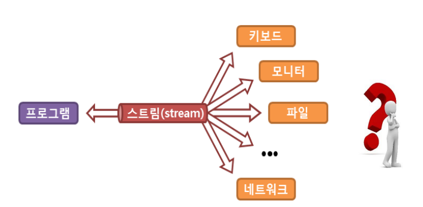
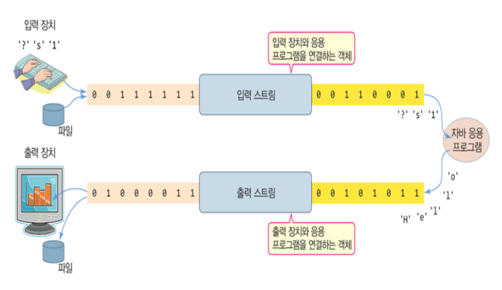

# 2023-03-29

---

### 매개변수의 메서드 참조

람다식에서 제공되는 a 매개변수의 메서드를 호출할 때 b 매개변수를 매개 값으로 사용

```java
(a, b) -> { a.instanceMethod(b); }
```

a의 클래스 이름 뒤에 :: 기호를 붙이고 메소드 이름을 기술

```java
클래스 :: instanceMethod
String :: compareToIgnoreCase
```

### 생성자 참조

객체를 생성하는 것. 

람다식이 단순히 객체를 생성하고 리턴하도록 구성되면 람다식을 생성자 참조로 대치 가능

```java
(a, b) -> { return new 클래스(a, b); }
```

클래스 이름 뒤에 :: 기호를 붙이고 new 연산자를 기술

```java
클래스 :: new
```

생성자가 오버로딩 되어 여러 개가 있을 경우, 컴파일러는 함수형 인터페이스의 추상 메소드와 동일한 매개변수 타입과 개수를 가지고 있는 생성자를 찾아 호출. 

(해당 생성자가 존재하지 않으면 컴파일 오류 발생)

---

### Java 8 Stream API

- Java I/O 스트림





- 자바8에서 추가된 스트림(Data 스트림)
    
    컬렉션, 배열 등에 저장된 요소들을 하나씩 참조하면서 코드를 실행할 수 있는 기능
    


- 자료의 대상과 관계없이 동일한 연산을 수행할 수 있게 하는 기능
- Array, Collection에 동일한 연산이 수행돼서 일관성 있는 처리 기능을 갖게 한다
- 스트림은 1회성이라 한번 사용한 스트림은 재사용 하지 못한다
- 스트림의 연산은 기존의 자료를 변경하지 않고, 새로운 메모리 위에서 동작한다
- 중간연산과 최종 연산이 구분되며, 최종 연산이 수행된 이후 모든 연산이 적용되는 지연연산을 지원한다.

Java 8부터 컬렉션 및 배열의 요소를 반복 처리하기 위해 스트림을 사용하는데 이는 요소들이 하나씩 흘러가면서 처리된다는 의미이다.

```java
Stream<String> stream = list.stream();
stream.forEach( item -> /* item 처리 */ );
```

List 컬렉션의 stream()메서드로 Stream 객체를 얻고, forEach()메서드로 요소를 어떻게 처리할지 람다식으로 제공하여 처리.

### 외부 반복자와 내부 반복자

외부반복자는 일반적으로 사용하는 루프처럼 요소를 사용하는 쪽에서 직접 컬렉션 요소를 하나씩 꺼내 와서 반복 처리하나 내부반복자는 처리할 행동(보통 콜백 함수)을 컬렉션 요소에 넘겨주어 반복 처리한다.

요소 처리 방법을 컬렉션 내부로 주입시켜서 요소를 반복 처리.

개발자 코드에서 제공한 데이터 처리 코드(람다식)를 가지고 컬렉션 내부에서 요소를 반복 처리.

내부 반복자는 멀티 코어 CPU를 최대한 활용하기 위해 요소들을 분배 시켜 병렬 작업 가능.


스트림은 내부 반복자이다.

- 처리속도가 빠르고 병렬처리에 효율적이다.
- 람다식으로 다양한 요소 처리를 정의한다.
- 중간 처리와 최종 처리를 수행하도록 파이프 라인을 형성한다.
- 내부 반복자의 이점은 어떻게 요소를 반복시킬 것인가는 컬렉션에 맡기고, 개발자는 요소 처리 코드에만 집중할 수 있다.
- 요소들의 반복 순서를 변경하거나, 멀티 코어 CPU를 최대한 활용하기 위해 요소들을 분배시켜 병렬 작업을 할 수 있게 도와준다.

```java
List<String> list = Arrays.asList("A", "B", "C", "D");
// 스트림 사용 X
Iterator<String> iter = list.iterator();
while(iter.hasNext()){
 String name = iter.next();
 System.out.println(name);
}
// 스트림 사용
Stream<String> stream = list.stream();
list.stream().forEach(name -> System.out.println(name));
```

데이터가 많을수록 스트림 사용이 효율적이다.

### 스트림 파이프라인

컬렉션의 오리지널 스트림 뒤에 필터링 중간 스트림이 연결될 수 있고, 그 뒤에 매핑 중간 스트림이 연결될 수 있다.


오리지널 스트림과 집계 처리 사이의 중간 스트림들은 최종 처리를 위해 요소를 걸러내거나(필터링),요소를 변환시키거나(매핑), 정렬하는 작업을 수행한다.

최종 처리는 중간 처리에서 정제된 요소들을 반복하거나, 집계(카운팅, 총합, 평균) 작업을 수행한다.


### 스트림 인터페이스

java.util.stream 패키지에는 BaseStream 인터페이스를 부모로 한 자식 인터페이스들이 제공되며 BaseStream에는 모든 스트림에서 사용할 수 있는 공통 메소드들이 정의되어 있다.


- 컬렉션으로부터 스트림 얻기
    
    java.util.Collection 인터페이스는 stream()과 parallelStream() 메소드를 가지고 있어 자식 인터페이스인 List와 Set 인터페이스를 구현한 모든 컬렉션에서 객체 스트림을 얻을 수 있다.
    
- 배열로부터 스트림 얻기
    
    java.util.Arrays 클래스로 다양한 종류의 배열로부터 스트림을 얻을 수 있다.
    
- 숫자 범위로부터 스트림 얻기
    
    IntStream 또는 LongStream의 정적 메소드인 range()와 rangeClosed() 메소드로 특정 범위의 정수 스트림을 얻을 수 있다.
    
- 파일로부터 스트림 얻기
    
    java.nio.file.Files의 lines() 메소드로 텍스트 파일의 행 단위 스트림을 얻을 수 있음
    
    [ 스트림의 중간 처리 메서드와 최종 처리 메서드 ]
    
- Stream은 요소에 대해 중간 처리와 최종 처리를 수행할 수 있다.
- 중간 처리(매핑, 필터링, 정렬 등)는 여러 번 사용할 수 있다.
- 최종 처리(반복, 집계처리 등)는 결과 처리이므로 한 번만 사용할 수 있다.

| 종류 |  | 리턴타입 | 메서드 |
| --- | --- | --- | --- |
| 중간처리 | 필터링 |  | distinct() |
|  |  |  | filter() |
|  | 매핑 |  | flatMap() |
|  |  | Stream | map() |
|  |  |  | boxed() |
|  | 정렬 |  | sorted() |
|  | 루핑 |  | peek() |
| 최종처리 | 미칭 | boolean | allMatch() |
|  |  |  | anyMatch() |
|  |  |  | noneMatch() |
|  | 집계 | long | count() |
|  |  | OptionalXXX | findFirst() |
|  |  | OptionalXXX | max() |
|  |  | OptionalXXX | min() |
|  |  | OptiionalDouble | average() |
|  |  | OptionalXXX | reduce() |
|  |  | int, long, double | sum() |
|  | 루핑 | void | forEach() |
|  | 수집 | R | collect() |

```java
// return값이 stream객체가 아니다. -> 더 이상 스트림이 이어져서 가지 못한다.
stream.map(…).filter(…).distinct(…).collect(…)
stream.map(…).filter(…).distinct(…).count(…)
```

- **필터링 :  요소를 걸러내는 중간 처리 기능**


- **distinct() 메서드 : 요소의 중복을 제거**
- **filter() 메소드: 매개값으로 주어진 Predicate가 true를 리턴하는 요소만 필터링**
- **매핑 : 스트림의 요소를 다른 요소로 변환하는 중간 처리 기능**
    - 매핑 메소드: mapXxx(), asDoubleStream(), asLongStream(), boxed(), flatMapXxx() 등
    - 요소를 다른 요소로 변환
        - mapXxx() 메소드: 요소를 다른 요소로 변환한 새로운 스트림을 리턴
    
    