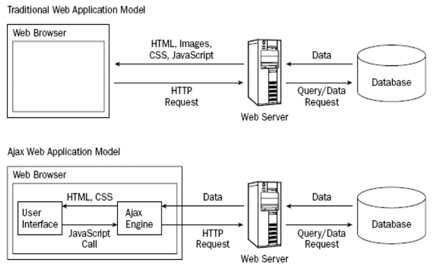
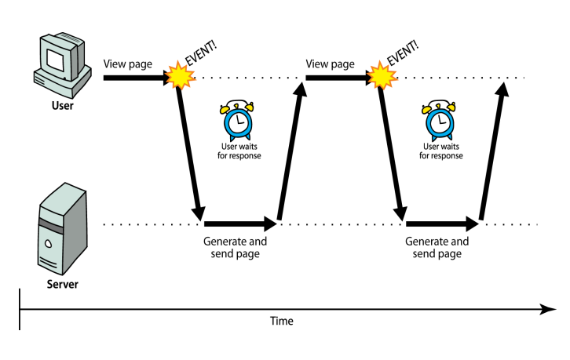
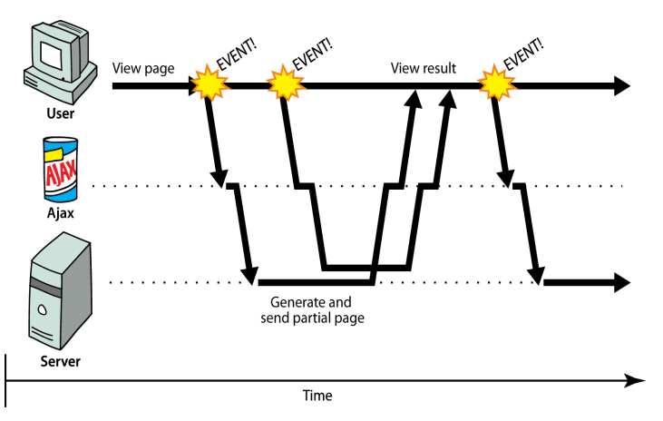

### XML(Extensible Markup Language)

XML : 규격화된 문서를 만드는 언어. 태그를 목적에 알맞게 직접 설계 (DTD, XML Schema)

XML 선언부를 제외하고는 기존 HTML5의 기본 구조와 사용 방법이 거의 유사gkek.

XML 문서 선언부

- 반드시 맨 앞에 명세, XML 문서 유형을 지정한다.
- XML문서 구조를 정의한 DTD(또는 XML Schema) 선언, 스타일을 정의한 CSS 연결에 대한 선언도 명세해야한다.
- 하나의 최상위 엘리먼트의 <시작태그>로 시작해서 </종료태그>로 끝난다.
- 최상위 엘리먼트를 포함하여 XML 문서의 모든 태그들은 자유롭게 정의한다.
- 엘리먼트의 시작 태그 안의 속성도 자유롭게 정의한다.

### JSON

JSON(제이슨, JavaScript Object Notation)은, 인터넷에서 자료를 주고 받을 때 그 자료를 표현하는 방법이다. 자료의 종류에 큰 제한은 없으며, 특히 컴퓨터 프로그램의 변수값을 표현하는 데 적합하다. 형식은 자바스크립트의 구문 형식을 따르지만, 프로그래밍 언어나 플랫폼에 독립적이므로 C, C++, C#, 자바, 자바스크립트, 펄, 파이썬 등 많은 언어에서 이용할 수 있다.

JSON 문법은 자바스크립트 표준인 ECMA-262 3판의 객체 문법에 바탕을 두며, 인코딩은 유니코드로 한다. 표현할 수 있는 기본 자료형으로는 수, 문자열, 참/거짓, null이 있고, 집합 자료형으로는 배열과 객체가 있다.
**JSON 장점**

- JSON은 텍스트로 이루어져 있으므로, 사람과 기계 모두 읽고 쓰기 쉽다.
- 프로그래밍 언어와 플랫폼에 독립적이므로, 서로 다른 시스템간에 객체를 교환하기에 좋다.
- JSON은 개방형 표준이며, 읽기 및 쓰기가 쉽고 가볍다.

---

### XML과 JSON 비교

```json
// JSON
{
	"students" : {
		"student" : [
			{"name":"홍길동","gender":"남"},
			{"name":"홍길순","gender":"여"},
		]
	}
}
```

```xml
// XML
<students>
	<student>
		<name>홍길동</name> <gender>남</gender>
	</student>
	<student>
		<name>홍길순</name> <gender>여</gender>
	</student>
</students>
```

---

### AJAX

AJAX = Asynchronous JavaScript and XML

고전적인 웹의 통신 방법은 웹페이지의 일부분을 갱신하기 위해서는 페이지 전체를 다시 로드해야 했다.

AJAX 의 핵심은 재로드(refresh 재갱신) 하지않고 웹페이지의 일부만을 갱신하여 웹서버와 데이터를 교환하는 방법이다. 즉, 빠르게 동적 웹페이지를 생성하는 기술이다.

---

**고전적 웹 통신과 AJAX 웹 통신**



---

**고전적 웹 통신(동기)**



---

**AJAX 웹 통신(비동기)**



---

**AJAX의 동작과정**

- 이벤트 발생에 의해 이벤트핸들러 역할의 JavaScript 함수를 호출.
- 핸들러 함수에서 XMLHttpRequest 객체를 생성한다. 요청이 종료되었을 때 처리할 기능을 콜백함수로 만들어 등록.
- XMLHttpRequest 객체를 통해 서버에 요청을 보낸다.
- 요청을 받은 서버는 요청 결과를 적당한 데이터로 구성하여 응답.
- XMLHttpRequest 객체에 의해 등록된 콜백함수를 호출하여 응답 결과를 현재 웹 페이지에 반영.

---

### XMLHttpRequest 객체

- 서버 측과의 비동기 통신을 제어하는 것은 XMLHttpRequest 객체의 역할.
- XMLHttpRequest 객체를 이용함으로써 지금까지브라우저가 실행해온 서버와의통신 부분을
JavaScript가 제어할 수 있게 된다.
- XMLHttpRequest 객체 생성 : new XMLHttpRequest()

| 분류 | 멤버 | 개요 |
| --- | --- | --- |
| 프로퍼티 | onreadystatechange | 통신상태가변화된타이밍에호출되는이벤트핸들러 |
|  | readyState | HTTP 통신상태를취득 |
|  | status | HTTP Status코드를취득 |
|  | responseType | 응답받으려는 컨텐트 타입. "arraybuffer", "blob", "document", "json", and "text" |
|  | responseText | 응답본체를 plaintext로취득 |
|  | responseXML | 응답본체를 XML(XMLDocument 객체)로취득 |
|  | response | 지정된 응답 타입에 따른 응답객체 |
|  | upload | XMLHttpRequestUpload 객체 제공 |
| 메서드 | abort() | 현재의비동기통신을중단 |
|  | getAllResponseHeaders() | 수신한모든 HTTP 응답헤더를취득 |
|  | getResponseHeader(header) | 지정한 HTTP 응답헤더를취득 |
|  | open( ... )  | HTTP 요청을초기화 |
|  | setRequestHeader(header, va
lue) | 요청 시에송신하는헤더를추가 |
|  | send([body]) | HTTP 요청을송신(인수 body는요청본체)
get : 아규먼트가 필요없다.
post : 아규먼트를 주어야한다. |

### open()와 send() 메서드

- open(HTTP 메서드, URL [, 비동기 모드 통신 여부])
    - HTTP 메서드: 요청방식(GET, POST, PUT, DELETE..)
    - URL : AJAX 로요청하려는서버의대상페이지
    - 비동기모드통신여부: true(비동기통신), false(동기통신)
- send([요청파라미터])
    - POST 의경우Query 문자열을인수로지정
    - ArrayBufferView, Blob, Document, DOMString, FormData, null 이올수있다.

---

### FormData 객체

FormData객체는 폼의 각 필드와값을 나타내는 키/값 쌍들의 집합을쉽게 구성할수 있는 방법을 제공하며, 이를 이용하면 데이터를 “multipart/form-data” 형식으로 XMLHttpRequest의send() 메소드를 사용하여 쉽게 전송할 수 있다.

```json
// aFile은input type="file" 이나드래그앤드롭된파일로부터온값
var formdata= new FormData();
formdata.append("nickname", "Foooobar");
formdata.append("website", "http://hacks.mozilla.org");
formdata.append("media", aFile);
varxhr= new XMLHttpRequest();
xhr.open("POST", "http://foo.bar/upload.php");
xhr.send(formdata);
```

HTML from 엘리먼트의 DOM 객체는 폼의 데이터를 FormData객체로 얻게 해주는 getFormData() 메소드를 제공한다.

```json
var formElement= document.getElementById("myFormElement");
formData= formElement.getFormData();
formData.append("serialnumber", serialNumber++);
xhr.send(formData);
```

### readyState 값

| 반환값 | 개요 |
| --- | --- |
| 0 | 미초기화(open 메서드가호출되지않음) |
| 1 | 로드 중(open 메서드는호출됐지만, send 메서드는호출되지않았다) |
| 2 | 로드 완료(send 메서드는호출됐지만, 응답스테이터스/헤더는 미취득) |
| 3 | 일부 응답을 취득(응답스테이터스/헤더만취득, 본체는미취득) |
| 4 | 모든 응답데이터를 취득 완료 |

**XMLHttpRequest 객체에서 제공되는 이벤트 관련 속성**

```xml
onloadstart
onprogress
onabort
onerror
onload
ontimeout
onloadend
onreadystatechange
```

---

웹 클라이언트에서 웹 서버에 요청을 보낼 때 name=value로 구성된 데이터를 함께 전달 가능하다.

- GET 방식 : 요청 대상 URL 문자열 뒤에 ?기호와 함께 추가되어 전달되는 방식(패스워드 같은 것들은 사용될 수 없다. → 외부로 유출되면 안되기 때문)으로 길이에 대한 제한이 있다. → 쿼리문자열
- POST 방식 : 요청 바디안에 담아서 전달하기 대문에 길이에 제한이 없다 → 요청파라미터
    
    majortype/minortype ⇒ MIME type
    
    image.gif
    
    image.jpg
    
    image.png
    

---

### Same Origin Policy(SOP)

브라우저에서 보안상의 이슈로 동일 사이트의 자원(Resource)만 접근해야 한다는 제약.

AJAX는 이 제약에 영향을 받으므로 Origin 서버가 아니면 AJAX로 요청한 컨텐츠를 수신할 수 없다.