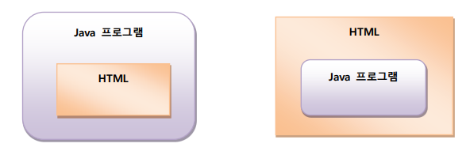
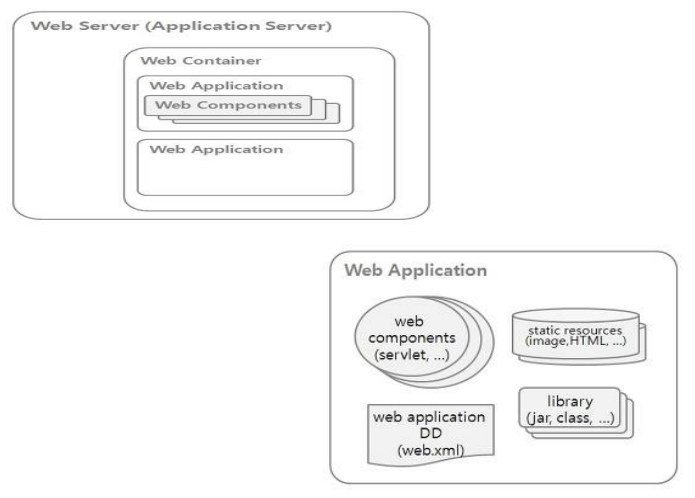
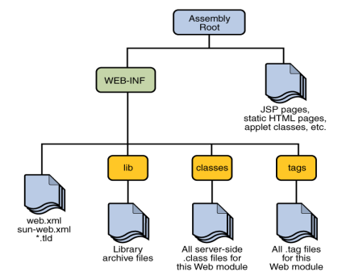
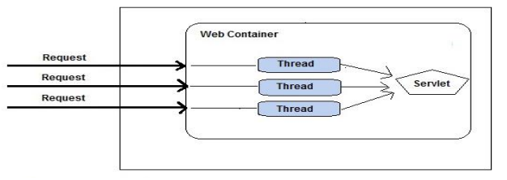
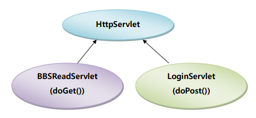
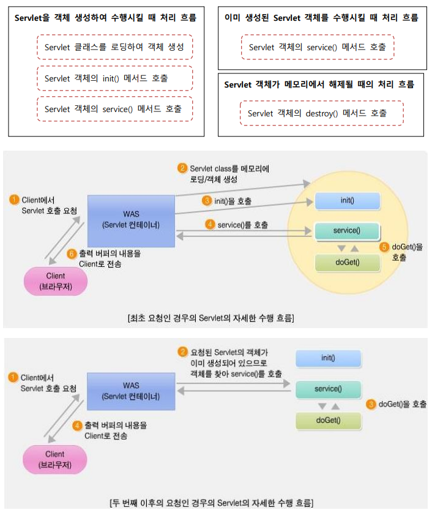
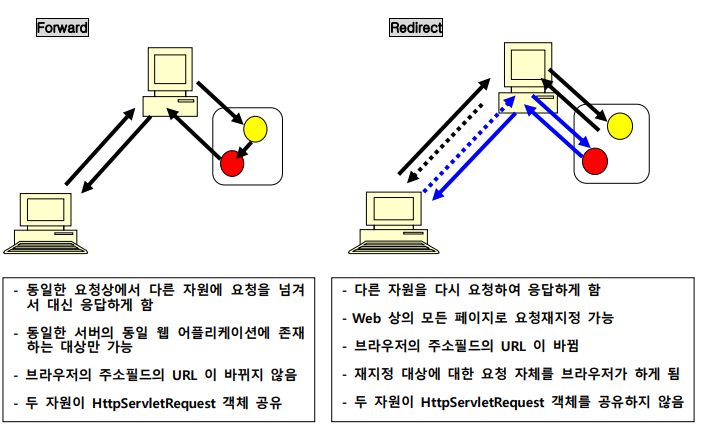
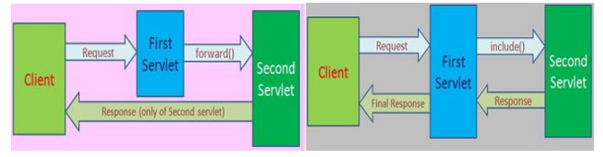

### Servlet & JSP

웹 통신에 사용되는 표준 통신 프로토콜은 HTTP(HyperText Transfer Protocol) 이다. 

HTTP는 웹 클라이언트와 웹 서버 사이에 이루어지는 요청과 응답(request/response)에 대한 프로토콜이다.

HTTP 프로토콜은 Connection Oriented와 Stateless 방식으로 동작하는 프로토콜이다.

| 요청방식 | 설명 |
| --- | --- |
| GET | URI에 지정된 파일을 얻고자 할 때 사용되는 요청 방식으로 디폴트 방식이다. name=value로
구성되는 간단한 데이터(Query 문자열)를 URI 뒤에 추가하여 전달하면서 요청하고자 하는 경
우에도 사용된다. http://localhost:8080/test.jsp?productid=00001 |
| HEAD | GET과 동일하나 바디 내용은 받지 않고 HTTP 헤더 정보만 받는다. |
| POST | 원하는 방식으로 인코딩 된 데이터를 요청 바디에 포함하여 전송하면서 파일을 요청하고자 하
는 경우 사용된다. Query 문자열 전달시의 GET 방식을 보완한 요청 방식이다. |
| OPTIONS | 요청 URI에 대하여 허용되는 통신 옵션을 알고자 할 때 사용된다. |
| DELETE | 서버에서 요청 URI에 지정된 자원을 지울 수 있다. |
| PUT | 데이터를 수정하는 요청에 사용한다 |
| TRACE | 클라이언트의 요청을 그대로 반환. 서버의 상태를 확인하기 위해 사용된다. |

---

### Java EE 기반의 웹 어플리케이션

Servlet 과 JSP 는 Java 의 Enterprise Edition 에 속하는 웹 어플리케이션 기술로서 웹 클라이언트의 요청에 의해 웹 서버에서 수행되고 그 수행 결과가 클라이언트에 응답되는 기술로서 Servlet 기술은 프로그래밍 성격이 강하며 JSP 는 프리젠테이션 성격이 강하다.

Servlet 은 상속 구문과 메서드 오버라이딩 구문을 적용한 Java 로 구현된 프로그램으로서 수행 결과를 HTML로 응답하도록 구현하는 기술이며 JSP 는 HTML 문서 안에 JSP 태그와 동적인 처리를 담당하는 Java 코드를 삽입하여 구현하는 기술이다.



Java EE 환경에서 Servlet 과 JSP 는 웹 컨테이너(엔진이라고도 함)에 의해 관리되고 수행되는 웹 컴포넌트로서 여러 웹 컴포넌트들이 모여 하나의 웹 어플리케이션을 구성하게 된다.

하나의 웹 어플리케이션 안에는 하나의 WAS가 할당된다.



**웹 어플리케이션의 디렉토리 구조**



---

### Servlet 프로그래밍

Server Side Applet의 약어.

CGI는 요청이 있을 때마다 새로운 프로세스가 생성되어 응답하는 데에 비해, Java Servlet은 요청마다 프로세스보다 가벼운 스레드 기반으로 응답하므로 보다 가볍게 클라이언트 요청 처리할 수 있다. 

또한, Java Servlet은 Java 로 구현되므로 다양한 플랫폼에서 동작 가능하다.

또한 웹 클라이언트로부터의 수행 요청으로 생성된 Servlet의 객체는 수행이 종료되어 응답된 후에도 객체 상태를 계속 유지하면서 다음 요청에 대하여 바로 수행될 수 있는 상태를 유지한다. 

또한 하나의 Servlet을 여러 클라이언트가 동시 요청했을 때 하나의 Servlet 객체를 공유하여 다중 스레드기반에서 처리되므로 응답 성능을 향상시킬 수 있다.



### Servlet 의 구현 방법

Servlet 은 HttpServlet 이라는 클래스를 상속하여 구현하며 어떠한 요청 방식을 지원하는 Servlet 인가에 따라 doGet() 또는 doPost() 메서드를 오버라이딩하여 구현한다.



---

**멤버변수 :** 하나의 서블릿에 여러 클라이언트가 공유해서 사용해야 하는 데이터

**지역변수 :** 각각의 클라이언트가 독립적으로 사용해야 하는 데이터

```java
// 최초로 호출
	public void init(ServletConfig config) throws ServletException {
		System.out.println("init() 메서드 호출....");
	}
// 마지막으로 호출
public void destroy() {
	System.out.println("destroy() 메서드 호출....");
}
// 클라이언트가 요청을 할 때마다 호출
protected void service(HttpServletRequest request, HttpServletResponse response) throws ServletException, IOException {
	System.out.println("service() 메서드 호출....");
}
```

---

### Servlet의 등록과 매핑

Servlet 3.0 부터는 web.xml 에 작성되던 Servlet 등록과 매핑, 초기 파라미터 설정, 리스너나 필터 등록과 같은 내용들을 소스 내에서 Annotation 구문으로 대신할 수 있는 구현 방법을 지원하고 있다.

즉, Annotation을 사용하면 web.xml 에 일일이 설정 태그를 작성해주지 않아도 된다. 다음은 Servlet 3.0에서 지원되는 Annoation리스트이다.

```java
@WebServlet: Servlet 프로그램을 등록과 매핑을 정의한다.
@WebInitParam: Servlet 프로그램에 전달할 초기 파라미터를 정의한다.
@WebListener: 리스너를 정의한다.
@WebFilter: 필터를 정의한다.
@MultipartConfig: Servlet 프로그램에서 다중 파티션으로 전달되는 파일 업로드를 처리할 수 있음을 정의한다.
-------------------------------------------------------------------------------------------------
@WebServlet("/hello")
public class Hello1Servlet extends HttpServlet { ...... }
@WebServlet(urlPatterns = {"/hello1", "/hello2"})
public class Hello2Servlet extends HttpServlet { ...... }
@WebServlet(name = "HelloServletExample", urlPatterns = {"/hello"})
public class HelloServlet extends HttpServlet { ...... }
@WebServlet(
 name = "HelloServletExample",
 urlPatterns = {"/hello"},
 initParams = {
 @WebInitParam(name = "param1", value = "value1"),
 @WebInitParam(name = "param2", value = "value2")}
)
public class HelloServlet extends HttpServlet { ...... }
```

### 요청 및 응답 객체 생성

웹 클라이언트로부터 Servlet 수행 요청이 전달되면, Servlet 컨테이너는 클라이언트로부터 전달된 요청 정보를 HttpServletRequest 객체와 HttpServletResponse 객체를 생성하여 Servlet 의 doGet() 또는 doPost() 메서드 호출시 아규먼트로 전달.

HttpServletRequest 객체는 클라이언트에서 전달되는 다양한 요청 정보를 Servlet 에 전달하는 기능으로 사용되며, HttpServletResponse 객체는 클라이언트로의 응답에 사용되는 객체.

```java
- HttpServletRequest 객체 : 웹 클라이런트에서 전송되는 요청 정보 추출
getHeader(name), getHeaders(name), getHeaderNames().
getContentLength(), getContentType(), getCookies()
getRequestURI(), getQueryString(), getProtocol(), getMethod()

- HttpServletResponse 객체 : 웹 클라이언트로의 응답 처리
setStatusCode(int statuscode), sendError(int code, String message), sendRedirect(url)
setHeader(String headerName, String headerValue)
setContentType(String mimeType), setContentLength(int length)
```

---

### Servlet 객체 생성과 객체 해제



---

### Servlet의 실행

Servlet은 HttpServlet 클래스를 상속받아 어떠한 요청 방식을 지원하는 Servlet인가에 따라서 doGet() 또는 doPost() 메소드를 재정의하여 구현한다. 웹 클라이언트로부터 Servlet이 요청된 방식에 따라서 doGet() 또는 doPost() 메소드가 Servlet 컨테이너에 의해 호출되어 Servlet의 기능을 처리하게 된다.

- 하이퍼링크 텍스트(태그)를 클릭하여 요청한다. → GET 방식
- URL 을 주소필드에 입력하여 직접 요청한다. → GET 방식
- 태그로 요청한다. → GET 방식
- 태그로 요청한다. → method 속성의 값에 따라서 GET 방식 또는 POST 방식
- <IFRAME> 태그로 요청한다. → GET 방식

---

### <form>태그

HTML 문서에서 사용자의 입력을 서버로 전달하는 기능은  <form>태그를 이용해 구현

- action : 사용자의 입력 데이터를 처리할 CGI 프로그램의 URL 주소를 지정한다.
- method : 사용자 데이터를 넘겨주는 방식을 지정하는데, GET과 POST 방식 두 가지다. GET은 입력 내용을 요청 URI 뒤에 붙여서 보내고, POST는 요청 바디에 담아서 보낸다.
- enctype : 서버로 보내지는 데이터의 형식을 지정한다. 종류는 세가지가 지원된다

```java
1. application/x-www-form-urlencoded
디폴트 값은 이거다. 서버로 전송되기 전에 url-encode 된다는 뜻이다.
2. mutipart/form-data
파일 받으면서 설정해준게 이 값인데 이미지나 파일을 서버로 전송할 경우 이 방식을 사용한다고
한다.
3. text/plain
인코딩을 하지 않은 문자 그대로의 상태를 전송한다는 의미이다.
```

웹 브라우저 화면에 사용자 정보 입력 형식을 표시할 때는 <input>태그, <textarea>태그 그리고 <select>태그를 이용한다. 다음은 <input> 태그에서 지원하는 주요 속성이다

- text : 텍스트 입력
- password : 암호 입력
- checkbox : 체크 박스
- radio : 라디오 버튼
- file : 서버로 업로드할 파일 선택
- submit : 입력 데이터 전송
- reset : 입력 데이터 취소
- hidden : 서버로 전달할 name=value 쌍의 데이터 정의

```html
<input type=“email”>
 이메일 주소 입력시 사용
 서버로 전송시 이메일 형식 자동 체크
<input type=“url”>
 웹 사이트 주소 입력시 사용
<input type=“number”>
 숫자를 스핀 박스를 이용해서 입력가능
 min : 최소값, max, : 최대값, step : 간격, value : 초기값
<input type=“range”>
 슬라이드 막대를 숫자 선택
 min : 최소값, max, : 최대값, step : 간격, value : 초기값으로 생략시 중간에 위치.
<input type=“search”>
 검색 상자 삽입
검색어 입력하면 오른쪽에 x가 표시됨
<input type=“date”>, <input type=“month”>,
<input type=“week”>, <input type=“time”>
달력에서 날짜를 선택하거나 스핀 박스에서 시간을 선택
<input type=“color”>
색상 선택 상자 표시
```

### Query 문자열(요청 파라미터)

Query 문자열이란 웹 클라이언트에서 웹 서버에 요청을 보낼 때 추가로 전달하는 name 과 value 로 구성되는 문자열로서 요청 파라미터라고도 한다. 주로 다음과 같은 형식으로 전달되는데 전달방식은 GET 방식과 POST 방식이 있다

name1=value1&name2=value2&name3=value3

**GET 방식**

- 전달되는 Query 문자열의 길이에 제한이 있고 내용이 브라우저의 주소 필드에 보여진다.
- 태그를 사용해도 되고 요청 URL 에 ? 기호와 함께 직접 Query 문자열을 붙여서 전달하는 것도
가능하다.

**POST 방식**

- 전달되는 Query 문자열의 길이에 제한이 없고 내용이 브라우저의 주소 필드에 보여지지 않는다.
- 전달 내용이 요청 바디에 담겨져서 전달된다.  태그를 사용하여 요청할 때만 사용할 수 있다.

---

### Query 문자열의 추출

- name 으로 하나의 value 값이 전달될 때
    
    String address = request.getParameter(“address”);
    
- name 으로 여러 개의 value 값들이 전달될 때
    
    String hobby[ ] = request.getParameterValues(“hobby”);
    

### Query 문자열 추출시의 한글 문제

Servlet 에서 위의 메서드들을 사용하여 Query 문자열을 추출할 때 한글 깨짐 현상이 발생한다. 해결 방법은 요청 방식에 따라 다르다.

- GET 방식 – 서버에 따라 다르다.
Tomcat 8.0 : 한글 문제가 발생하지 않는다.
Tomcat 7.0 이하 : 환경 파일인 server.xml 파일에서 protocol="HTTP/1.1" 속성을 포함하고 있는 <Connector> 태그를 찾아 URIEncoding=”utf-8” 속성을 추가한다.
- POST 방식 – Query 문자열을 추출하기 전에 HttpServletRequest 에서 제공되는 setCharacterEncoding(“utf-8”) 을 필수적으로 호출해야한다.

---

### 요청 재지정

요청재지정이란 클라이언트에서 요청한 페이지 대신 다른 페이지를 클라이언트가 보게 되는 기능으로 두가지 방법으로 나뉜다.

- redirect : HttpServletResponse 의 sendRedirect() 메서드를 사용한다.
    - 다른 웹 애플리케이션에서도 가능하다.
- forward : RequestDispatcher 의 forward() 메서드를 사용한다.
    - 동일한 웹 애플리케이션 안에서만 가능하다.




RequestDispatcher 를 사용하는 요청 재지정 방법은 forward() 메서드 외에도 include() 메서드가 사용될 수 있다.

- forward() : 요청 페이지 대신 다른 페이지가 대신 응답하게 한다.
- include() : 요청 페이지 안에 다른 페이지의 처리 내용이 포함되어 같이 응답하게 된다.
