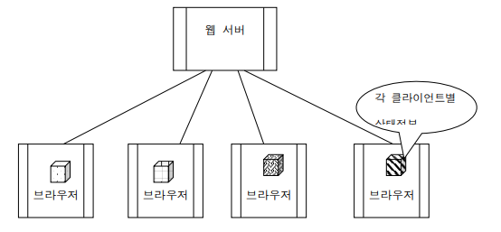
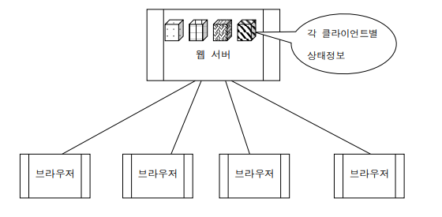
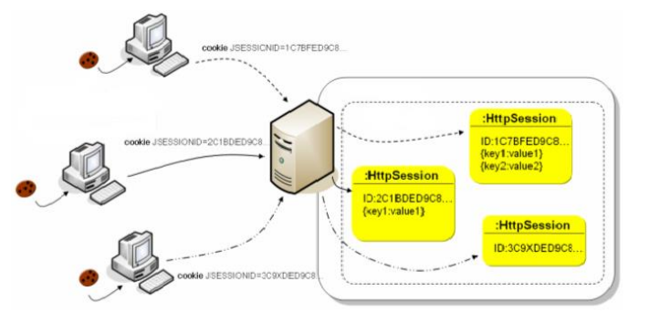

```java
// 배열에서 마지막문자열 빼고 ,와 함께 출력하기
String result = String.join(", ", aRequest);
```

### 상태정보 유지 기술

웹 브라우저에서 웹 서버에 정보를 요청할 때 이전 접속시의 결과물(상태정보)를 일정시간 동안 유지하는 것을 상태정보 유지라고 한다. 상태정보 유지 방법은 여러 가지가 있으며 상태 정보를 클라이언트에 저장하는 방식과 서버에 저장하는 방식이 있다.

- Cookie를 이용한 방법
- HttpSession 객체를 이용한 방법
- URL 문자열 뒤에 추가하는 방법
- <form> 태그의 hidden 타입을 사용하는 방법

**클라이언트 저장**



**서버 저장**



### HttpSession 객체를 이용한 상태정보 유지

- 상태 정보는 객체로 만들어서 서버에 보관한다.
- 상태 정보가 유지되는 최대 시간은 요청을 보내온 브라우저가 기동되어 있는 동안이다.
- 구현 방법
    - (1) HttpSession 객체를 생성하거나 추출.
    - (2) HttpSession 객체에 상태정보를 보관할 객체를 등록. (한번만 등록하면 됨.)
    - (3) HttpSession 객체에 등록되어 있는 상태정보 객체의 참조 값을 얻어서 사용.(읽기, 변경)
    - (4) HttpSession 객체에 등록되어 있는 상태정보 객체가 더 이상 필요 없으면 삭제할 수 있음.
    
    ```java
    (1) HttpSession session = request.getSession();
    
    (2) session.setAttribute(“xxx”, new Data());
    
    (3) Data ref = (Data)session.getAttribute(“xxx”);
    
    (4) session.removeAttribute(“xxx”);
    ```
    
- request.getSession() : HttpSession 객체를 추출하거나 새로이 생성한다. request.getSession(true) 와 동일하다. request.getSession(false) 는 HttpSession 객체를 추출하여 리턴하는데 없으면 null을 리턴.
- session.setAttribute(“xxx”, new Data()) : 보관하려는 정보를 객체로 만들어 HttpSession객체에 저장한다. “xxx” 라는 이름으로 객체의 참조 값을 보관.
- session.getAttribute(“xxx”) : “xxx” 라는 이름으로 보관된 객체에 대한 참조 값을 리턴.
- session.removeAttribute(“xxx”) : “xxx” 라는 이름으로 보관된 객체에 대한 참조 값을 삭제.
- session.invalidate() : HttpSession 객체를 강제로 삭제.

---

서버상에 생성되는 HttpSession 객체는 웹 클라이언트별로 하나씩 만들어진다. HttpSession 객체가 생성될 때 세션ID 가 하나 부여되며 이 세션ID 는 요청을 보내온 클라이언트의 브라우저에 쿠키 기술로 저장된다. 브라우저에 저장되는 세션ID에 대한 쿠키는 최대 유지 시간이 브라우저가 기동되어 있는 동안이다. 

만일 브라우저가 재 기동 되어 세션ID 를 분실하게 되면 서버에 생성된 HttpSession 객체는 더 이상 사용 불가하게 된다. 뿐만 아니라 클라이언트로부터 일정시간 동안 요청이 없는 경우((Inactive Interval Time : 기본 30분)) 에도 서버에 생성된 HttpSession 객체는 더 이상 사용 불가하게 된다.



value : 등록되는 객체에 대한 참조값

---