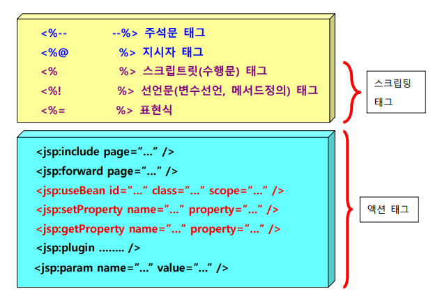

### JSP 프로그래밍

웹 클라이언트에서 JSP의 실행을 요청하면 서버의 JSP 컨테이너(컨버터)에 의해 Servlet 소스코드로 변환되고 컴파일된 후 실행 가능한 Servlet 클래스가 된다. 이 때 부터는 Servlet 컨테이너에 의해 객체 생성되어 실행되며 실행 흐름과 특성은 Servlet 과 동일하다. JSP 가 Servlet 소스 코드로 변환되는 것은 JSP 가 작성 또는 수정된 후 최초 요청 시에만 처리된다.

일부는 서버에서 일부는 클라이언트에서 사용해야할 경우 JSP를 사용한다.

### JSP 태그의 종류

### JSP의 내장 객체

| 객체변수 | 클래스 및 인터페이스 | 설 명 |
| --- | --- | --- |
| request | http.HttpServletRequest | 클라이언트에서 전송되는 다양한 요청 데이터 추출 |
| response | http.HttpServletResponse | 응답 시 필요한 기능을 제공 |
| pageContext | jsp.PageContext | 페이지가 처리되는 시점에서의 외부 환경 데이터 추출 |
| session | http.HttpSession | 클라이언트 별로 생성되는 HttpSession 객체 |
| application | ServletContext | application scope 객체 생성과 관리 |
| config | ServletConfig | Servlet 구성 데이터 추출 |
| out | jsp.JspWriter | 응답용 출력 스트림 |
| page | jsp.HttpJspPage | 페이지의 Servlet 인스턴스 |
| exception | java.lang.Throwable | 생성된 예외 객체를 참조 |

---

**JSP의 GET방식? POST방식?**

JSP는 요청방식을 구분하지 않는다.

선언문태그 - 멤버변수

수행문태그 - 지역변수