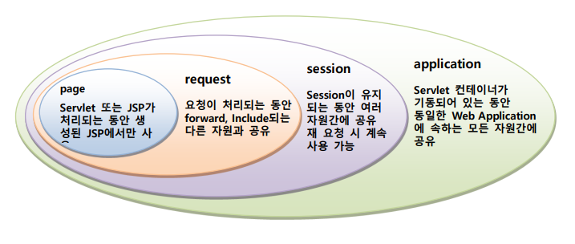

### ServletContext

실행환경, 실행엔진, 실행컨테이너

데이터를 보관하는 기능을 제공하는 API가 있다.

ServletContext : 서버가 종료될 때가지 유지. 모든 클라이언트가 공유 ——— application scope

HttpSession  : 브라우저가 기동되어 있는 동안 유지. 클라이언트 별로 ——— session scope

HttpServletRequest : 요청동안 유지. 클라이언트 별로 ——— request scope

pageContext : 기동된 페이지에서만 유지. ——— page scope 

setAttribute(”이름”,객체)

getAttribute(”이름”)

removeAttribute(”이름”)

---

EL → 표현식 태그구현은 더욱 간단하게 처리할 수 있다.(getter method, HashMap<>()의 key값 사용시 용이함)

<%= %>

<% out.print(request.getParameter(”addr”)); %>

<%= reques.getParameter(”addr”) %>

${ param.addr }

1) 어딘가에 저장되어 있는 데이터를 꺼내서 출력

2) 어떤식의 수행 결과를 출력

EL만의 내장 객체를 이용해서 표현하고자 하는 구현을 편하게

---

**EL(Expression Language)의 내장 객체**

```html
pageContext - PageContext 객체
pageScope - page 스코프에 포함된 객체들
requestScope - request 스코프에 포함된 객체들
sessionScope - session 스코프에 포함된 객체들
applicationScope - application 스코프에 포함된 객체들
param - HTTP의 파라메터들
paramValues - 한 파라메터의 값들
header - 헤더 정보들
headerValues - 한 헤더의 값들
cookie – 쿠키들
initParam - 컨텍스트의 초기화 파라미터들
```

EL에서의 변수 : 어딘가에 보관되어있는 객체의 이름

---

### 객체 공유

객체의 스코프란 객체가 생성되어 유지되는 기간을 의미하며 Page Scope, Request Scope, Session Scope 그리고 Application Scope로 구성된다.

- Page Scope : Servlet 또는 JSP가 수행되는 동안만 유효한 객체가 된다.
- Request Scope : Web 클라이언트로 부터의 요청이 끝날 때까지 유효한 객체가 된다.
- Session Scope : 요청을 보내온 Web 클라이언트가 기동되어 있는 동안 유효한 객체가 된다.
- Application Scope : 서버가 기동되어 있는 동안 유효한 객체가 된다.
    
    Request Scope → HttpServletRequest 객체에 객체를 보관한다.
    
    Session Scope → HttpSession 객체에 객체를 보관한다.
    
    Application Scope → ServletContext 객체에 객체를 보관한다.
    

HttpServletRequest, HttpSession 그리고 ServletContext 는 모두 객체를 저장하는 방으로 사용하는 것이 가능하며 다음과 같은 객체의 저장, 추출, 삭제 기능의 메서드들을 지원한다

public void setAttribute(String key, Object value)

public Object getAttribute(String key)

public void removeAttribute(String key)

Servlet : 보관

JSP: 꺼내기

**Servlet 과 JSP 에서 사용되는 Java 객체의 scope**



---

### MVC(Model-View-Controller) 패턴

사용자 인터페이스로부터 비즈니스 로직을 분리하여 어플리케이션의 시각적 요소나 그 이면에서 실행되는 비즈니스 로직을 서로 영향 없이 쉽게 고칠 수 있는 어플리케이션을 만들 수 있다. 

MVC에서 모델은 어플리케이션의 정보(데이터)를 담당하며, 뷰는 텍스트, 체크박스 항목 등과 같은 사용자 인터페이스 요소를 담당하고, 컨트롤러는 데이터와 비즈니스 로직 사이의 상호동작 관리하며 그리고 어플리케이션의 기능을 담당한다.