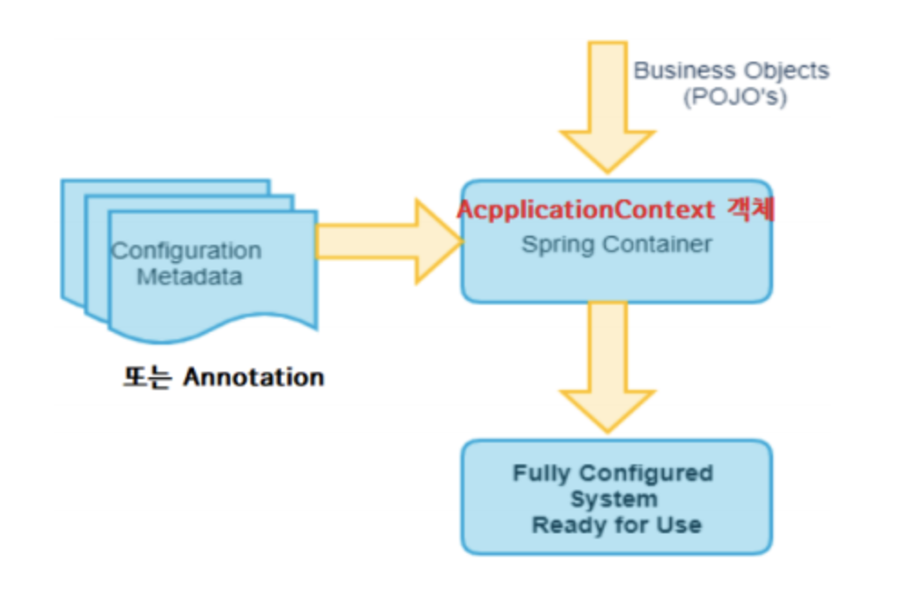

### Spring Ioc 와 DI

프로그램에서 필요한 객체의 생성을 Spring FW에서 하고 객체를 필요로 하는 곳에 주입하는 것 그리고 객체를 찾을 때 제공하는 것 모두 Spring FW이 대신 처리한다.

Spring FW에 의해 관리되는 Java 객체를 “bean”이라고 부르며 이 일을 담당하는 Spring FW의 구성요소를 IoC 컨테이너 또는 스프링 컨테이너라고 한다. 

Spring DI는 객체간의 결합도를 느슨하게 하는 스프링의 핵심 기술이다.

**Spring IoC 컨테이너 초기화**

ApplicationContext context = new ClassPathXmlApplicationContext(”빈 설정 파일”);

**DL의 예**

타입명 bean = (타입명)context.getBean(”빈이름”);

**DI의 예**

- Construction Injection : 생성자를 통해서 객체 바인딩(의존관계를 연결)
- Setter Injection : setter 메서드를 이용해서 객체 바인딩(의존관계를 연결)
- method Injection : 어노테이션을 정의한 메서드를 이용해서 객체 바인딩(의존관계를 연결)
- field Injection : 어노테이션을 정의한 메서드를 이용해서 객체 바인딩(의존관계를 연결)

**XML 설정**

- 설정 정보를 변경할 대는 XML만 변경하면 된다.
- 많은 프레임워크의 라이브러리가 XML 스키마를 이용한 설정의 편리함을 지원한다.
- 프로젝트의 규모에 따라서 XML문서의 내용이 많아지게 된다.
- 코드를 실행해야 설정 정보의 오류를 확인할 수 있다.

**ANNOTATION 설정**

소스안에 정해진 ANNOTATION들을 사용한다.

### XML 설정

<bean> 태그 : 

Spring Ioc 컨테이너가 관리할 Bean 객체(자바 클래스) 설정

id : 주입 받을 곳에서 호출할 이름

class : 주입할 객체의 클래스명

factory-method : 객체 생성시 사용될 factory 메서드

scope : Bean 객체의 유효 범위 설정(Singleton, prototype 등)

<Constructor-arg> 태그 : 

<bean>의 하위 태그로 다른 bean 객체 또는 값을 생성자를 통해 주입하도록 설정

<ref bean=”bean name”/> ⇒ 객체를 주입시 type 속성 : 값의 타입을 명시해야 하는 경우

[속성 이용]

- ref=”bean 이름”
- value=”값”

<property> 태그 :

<bean>의 하위 태그로 다른 bean 객체 또는 값을 setter 메서드를 통해 주입하도록 설정

name 속성 : 객체 또는 값을 주입할 property 이름을 설정(setter의 이름)

<ref bean=”bean name”/> ⇒ 객체를 주입 시 <value>값</value> ⇒ 문자(String), Primitive data 주입 시 type 속성 : 값의 타입을 명시해야 하는 경우

[속성 이용]

- ref=”bean 이름”
- value=”값”

스프링은 기본적으로 Singleton이며, Singleton - **객체의 인스턴스가 오직 1개만 생성**되는 패턴이다.