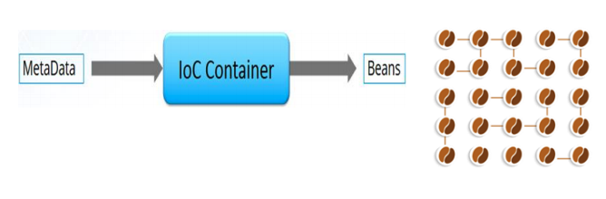
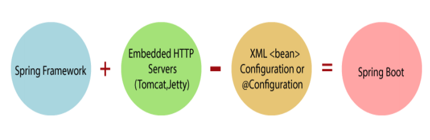

### ANNOTATION 설정

@Component

클래스에 선언하며 해당 클래스를 bean 객체로 등록한다. bean의 이름은 해당 클래스명(첫 글자는 소문자로 변경해서)이 사용된다. 범위는 드폴트로 singleton이며 @Scope를 사용하여 지정할 수 있다.

소스안에 작성된 어노테이션이 적용되려면 다음과 같은 태그들이 설정파일에 정의되어 있어야 한다.

<context:annotation-config> - @Autowired만 사용했을 때

<context:component-scan base-package=”xxx” /> - 모든 어노테이션

---

@Scope

스프링은 기본적으로 빈의 범위를 “singleton”으로 설정한다. “singleton”이 아닌 다른 범위를 지정하고 싶다면 @Scope 어노테이션을 이용하여 범위를 지정하면 된다.

설정 : prototype, singleton, request, session, globalSession

```java
@Component
@Scope(value=”prototype”)
public class Worker {
				.
				.
}
```

---

@Autowired

어노테이션은 Spring에서 의존관계를 자동으로 설정할 때 사용된다. 이 어노테이션은 생성자, 필드, 메서드 세 곳에 적용이 가능하며, 타입을 이용한 프로퍼티 자동 설정기능을 제공한다. 즉, 해당 타입의 빈 객체가 없으면 예외를 발생시킨다. 프로퍼티 설정 메서드(ex: setXXX())형식이 아닌 일반 메서드에도 적용 가능하다.

```java
@Autowired
@Qualifier("mytest")
private Test test;
```

같은 타입의 빈이 2개 이상 존재하게 되면 예외가 발생하는데, Autowired도 이러한 문제가 발생한다. 이런 경우에는 @Qualifier를 사용하면 동일한 타입의 빈 중 특정 빈을 사용하도록 하여 문제를 해결할 수 있다. 설정이 필수가 아닐 경우 @Autowired(required=false)로 선언한다.(기본값은 true)

---

@Qualifier

@Autowired 어노테이션과 함께 사용된다. 빈의 타입이 아닌 이름으로 주입하려는 경우 사용된다.

---

@Resource

자바 6 버전 및 JEE 5 버전에 추가된 것으로 어플리케이션에서 필요로 하는 자원을 자동 연결할 때 사용한다. Spring 2.5부터 지원하는 어노테이션으로 스프링에서 의존하는 Bean객체를 전달할 대 사용한다.

@Autowired와 동일한 기능이며 @Autowired와의 차이점은 @Autowired는 타입으로(by type), @Resource는 이름(by name)으로 연결한다.

설정파일에서 <context:annotation-config>태그를 사용해야 인식하며 name 속성에 자동으로 연결될 Bean 객체의 이름을 입력한다.

@Resource(name=”testDao”)

---

@Inject

JSR-330 표준 어노테이션으로 Spring 3부터 지원한다. 특정 Framwork에 종속되지 않은 어플리케이션을 구성하고자 하면 @Inject를 사용할것을 권장한다. @Inject를 사용하기 위해서는 JSR-330 라이브러리인 javax.inject-x.x.x.jar 파일이 추가되어야 한다.

---

### @Autowired, @Resource, @Inject 비교

@Autowired, @Resource, @Inject를 사용할 수 있는 위치는 약간의 차이가 있기 때문에 필요에 따라 적절히 사용해야한다.

- @Autowired : 멤버변수, setter 메서드, 생성자, 일반 메서드에 적용 가능
- @Resource : 멤버변수, setter 메서드에 적용 가능
- @Inject : 멤버변수, setter 메서드, 생성자, 일반 메서드에 적용 가능

@Autowired, @Resource, @Inject를 멤버변수에 정의하는 경우 별도의 setter 메서드를 정의하지 않아도 된다. 

|  | @Autowired | @Resource | @Inject |
| --- | --- | --- | --- |
| 범용 | 스프링 전용 | 자바에서 지원 | 자바에서 지원 |
| 연결방식 | 타입에 맞춰서 연결 | 이름에 맞춰서 연결 | 타입에 맞춰서 연결 |



---

**자바의 내장객체는 @Autowired가 안된다.**

---

### Spring Boot

스프링부트는 스프링으로 애플리케이션을 만들 때 필요한 초기 설정을 간편하게 처리해주는 별도의 프레임워크이다.

**스프링부트 사용 장점**

자체적인 웹 서버를 내장하고 있기 때문에 기존에 배포방식인 별도의 외장 웹 서버 설치 → 프로젝트를 War파일로 빌드하여 배포하는 방식에 비해 빠르고 간편하게 배포를 진행할 수 있다. 또한 독립적으로 실행 가능한 Jar 파일로 프로젝트를 빌드할 수 있어 클라우드 서비스 및 도커와 같은 가상화 환경에 빠르게 배포할 수 있다.



Spring : Java 기반의 애플리케이션 개발을 위한 오픈소스 프레임워크

Spring MVC : 웹 애플리케이션 개발에 있어 MVC 패턴을 적용할 수 있도록 Spring에서 제공하는 프레임워크

Spring Boot : Spring 설정들을 자동화하는 Spring 기반의 프레임워크