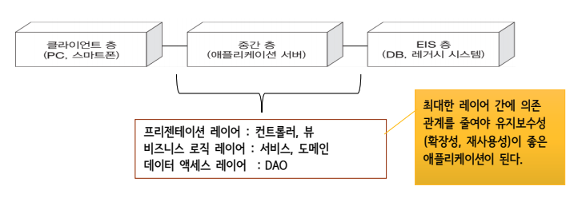
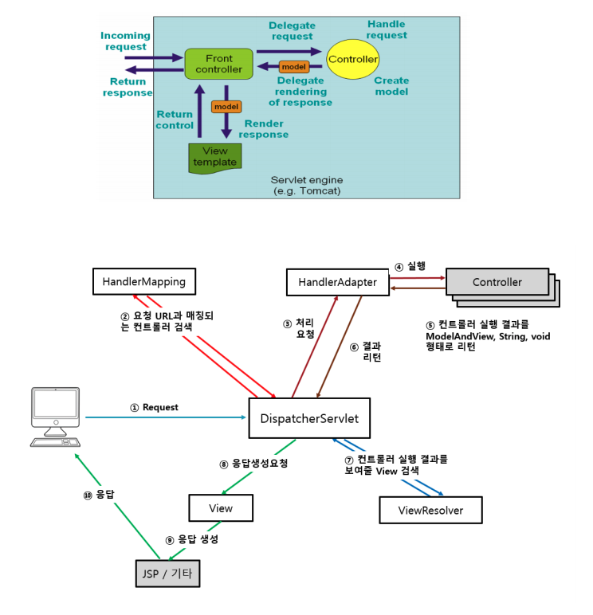

### 웹 애플리케이션

클라이언트와 서버 사이에 HTTP 프로토콜을 이용하여 데이터를 주고 받으면서 동작하는 소프트웨어 프르그램이다.

티어 : 어플리케이션의 구조를 물리적으로 나눈 것

레이어 : 어플리케이션의 구조를 논리적으로 나눈 것



### 스프링 MVC 처리 흐름

스프링 MVC는 프론트 컨트롤러 패턴을 적용한다. 프론트 컨트롤러 패턴이란, 하나의 핸들러 객체를 통해서 요청을 할당하고, 일관된 처리를 작성할 수 있게 하는 개발 패턴이다.



클라이언트 요청 → DispatcherServlet(프론트컨트롤러 역할. 스프링 제공)→ 요청 URL과 매칭되는 컨트롤러 검색 → 처리 요청 → 실행 → 컨트롤러 실행 결과물 ModelAndView, String, void 형태로 return → 결과 리턴 → 컨트롤러 실행 결과물을 보여줄 View 검색 → 응답 생성 요청 → 응답 생성 → 클라이언트에게 응답

---

1) DispatcherServlet

가장 앞서 요청을 받아들여 FrontController 라고 불린다.

스프링 프레임워크의 중심이 되는 서블릿으로 클라이언트의 모든 요청을 받아 흐름을 제어하며 각 컨트롤러에 요청을 전달하고 컨트롤러가 반환하는 결과값을 View에 전달해 응답한다.

web.xml에 정의되어 있으며, 보통 servlet-context.xml 설정 파일을 읽어 컨테이너를 구동한다.

2) HandlerMapping

클라이언트의 요청 URL을 처리할 컨트롤러를 결정해 DispatcherServlet에 반환한다.

@Controller 어노테이션이 적용된 객체의 @RequestMapping 값을 이용해 요청을 처리할 컨트롤러 탐색

3) HandlerAdapter

DispatcherServlet의 처리 요청을 변환해서 컨트롤러에게 전달한다.

컨트롤러의 응답 결과를 DispatcherServlet이 요구하는 형식으로 변환한다

4) Controller 

실제 클라이언트의 요청을 처리한 뒤 , 처리 결과를 void String, ModelAndView 형태로 반환하여 GET, POST 방식 등 전송 방식에 대한 처리를 어노테이션으로 처리

5) ViewResolver

컨트롤러의 처리 결과를 보여줄 뷰를 결정한다.

---

### Spring MVC 구현에서 사용되는 다양한 어노테이션

@Controller

Spring MVC의 Controller 클래스 선언을 단순화시켜준다. 스프링의 컨트롤러 클래스는 서블릿을 상속할 필요가 없다. @Controller로 등록된 클래스 파일에 대한 Bean 객체를 자동으로 생성한다. Controller로 사용하고자 하는 클래스에 @Controller 지정하면 component-scan 으로 자동 등록된다.

<context:component-scan base-package=“패키지명"/>

@Service

@Service를 적용한 Class는 비지니스 로직이 들어가는 Service로 등록이 된다. Controller에 있는 @Autowired는 @Service("xxxService")에 등록된 xxxService와 변수명이 같아야 하며 Service에 있는 @Autowired는 @Repository("xxxDao")에 등록된 xxDao와 변수명이 같아야 한다.

```java
@Service(“myHelloService")
 public class HelloServiceImpl implements HelloService {
	 @Autowired
	 private HelloDao helloDao;
	 public void hello() {
		 System.out.println("HelloServiceImpl :: hello()");
		 helloDao.selectHello();
	 }
 }
```

@RequestMapping

RequestMapping 어노테이션은 URL 문자열을 클래스 또는 메서드와 매핑시켜주는 역활을 한다. 클래스에 하나의 URL 매핑을 사용할 경우, 클래스 위에 @RequestMapping("/url")을 지정하며, GET 또는 POST 방식 등의 옵션을 줄 수 있다.

해당되는 method가 실행된 후, return 페이지가 따로 정의되어 있지 않으면 RequestMapping("/url")에서 설정된 url로 다시 돌아간다.