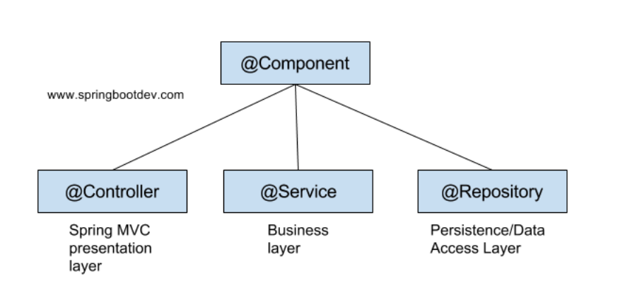
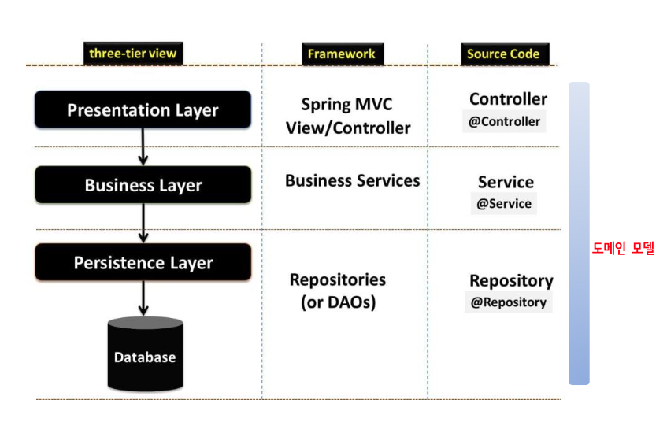

### Spring MVC 구현에서 사용되는 다양한 어노테이션



컨트롤러 : (프레젠테이션 레이어, 웹 요청과 응답을 템플릿을 통해 또는 직접 처리함)
로직 처리 : (서비스 레이어, 필요시 내부에서 비즈니스 로직을 처리함)
외부I/O 처리 : (퍼시스턴스 레이어, DB나 파일같은 외부 I/O 작업을 처리함)



| SQL 지정 방법  | 설명 |
| --- | --- |
| 매핑 파일 | ibatis 시절부터 지원된 전통적인 지정 방법으로, 마이바티스 기능을 완벽하게 이용할 수 있다. |
| 애노테이션 | Mybatis3부터 지원되는 방법으로, 개발의 용이성을 우선시할 때 효과적이다. SQL 지정은 간단하지만 애노테이션의 표현력과 유연성의 제약 탓에 복잡한 SQL이나 매핑을 지정할 때는 적합하지 않다. 표준 기능은 지원하지만 매핑 파일에서 표현할 수 있는 모든 것이 지원되는 것은 아니다. |

### SqlSession 객체의 주요 메서드

SQL 발행이나 트랜잭션 제어용 API 를 제공하는 컴포넌트이다. 마이바티스를 이용해 데이터베이스에 접근할 때 가장 중요한 역할을 하는 컴포넌트다. 

스프링 프레임워크에서 사용하는 경우에는 마이바티스 측의 트랜잭션 제어 API 는 사용하지 않으며 SqlSession 이 Mapper 파일에서 SQL 을 수행하고 결과 데이터를 반환하는 역할을 한다.

```java
T selectOne(String statement, Object parameter)
T selectOne(String statement)
List<E> selectList(String statement, Object parameter) List<E> selectList(String statement)
<T> Cursor<T> selectCursor(String statement, Object parameter)
<T> Cursor<T> selectCursor(String statement)
Map<K,V> selectMap(String statement, Object parameter, String mapKey) Map<K,V> selectMap(String statement, Object parameter)
int insert(String statement, Object parameter) int insert(String statement)
int delete(String statement, Object parameter) int delete(String statement)
int update(String statement, Object parameter) int update(String statement)
```

### Mybatis 의 SQL 매퍼 파일 생성과 활용
```java
// Mapper XML
<mapper namespace=”......”>
	<select id=”...” resultType=”...” parameterType=”...”>
	<insert id=”...” parameterType=”...”>
	<delete id=”...” parameterType=”...”> 
	<update id=”...” parameterType=”...”> 
	<sql id=”...”>
</mapper>

// DAO
public type className(NameVO vo) {
	mybatis.sqltag("NameDAO.name id"vo);
}
```