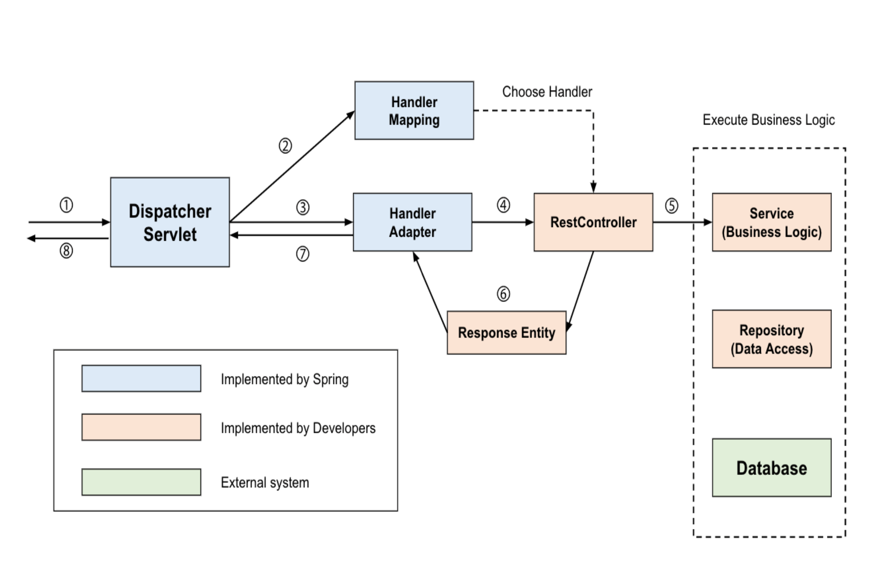
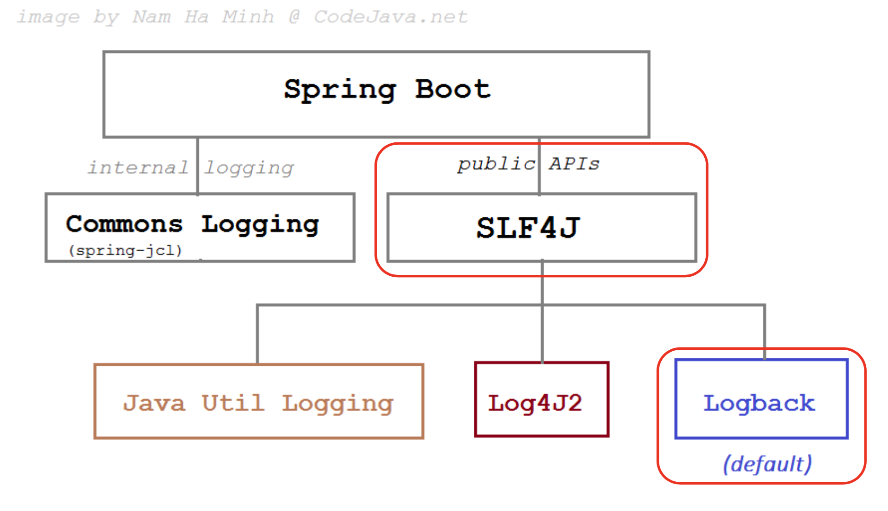

### DispatcherServlet 의 동작 과정

### 스프링 부트 로깅

LogBack 은 가장 많이 사용되었던 로깅 라이브러리인 Log4j 의 후속 버전으로 Log4j 를 더욱 성능을 좋게 만든 Java 의 오픈 소스 Logging Framework. 스프링 부트에 기본으로 설정 되어 있어 별도의 라이브러리를 추가하지 않아도 된다.

---

LogBack을 이옹하여 로깅을 수행하기 위해서 필요한 주요 설정요소로는 Logger, Appender, Encoder등 3가지가 있으며 각각은 다음과 같은 역할을 수행한다.

TRACE < DEBUG < INFO < WARN < ERROR

1) ERROR : 요청을 처리하는 중 오류가 발생한 경우 표시

2) WARM : 처리 가능한 문제, 향후 시스템 에러의 원인이 될 수 있는 경고성 메시지를 나타냄

3) INFO : 상태변경과 같은 정보성 로그를 표시

4) DEBUG : 프로그램을 디버깅하기 위한 정보를 표시

5) TRACE : Debug보다 훨씬 상세한 정보를 표시한다. (처리 흐름을 추적하기 위한)

로그에 설정할 수 있는 레벨은 총 5가지다. 출력 레벨의 설정에 따라 설정 레벨 이상의 로그를 출력한다. 로깅 레벨 설정을 “INFO”로 하였을 경우 “TRACE”, “DEBUG” 레벨은 무시한다. 스프링 부트에서는 간단히 application.properties에 값만 세팅해도 설정이 가능하다.

---

- 루트레벨(전체레벨)전체로깅레벨지정 --> 디폴트
    
    logging.level.root=info
    
- 패키지별로 로깅 레벨 지정
    
    다음 방법으로 상위 패키지의 디폴트 레벨을 설정하고, 하위 패키지들에 대한 각각의 로깅 레벨을 별도로 설정할 수 있다.
    
    logging.level.org.springframework.web=info
    
    logging.level.com.example.springedu=debug
    
    logging.level.thymeleaf.exam=trace
    

### logback-spring.xml 설정

- 대소문자 구별하지 않는다.
- name attribute 를 반드시 지정해야 한다.
- logback-spring.xml 은 appender 와 logger 크게 두개로 구분된다.
- Dynamic Reloading 기능을 지원한다.

예를 들어 60 초 주기마다 로그파일(logback-spring.xml)이 바뀌었는지 검사하고 바뀌었으면 프로그램을 갱신한다.