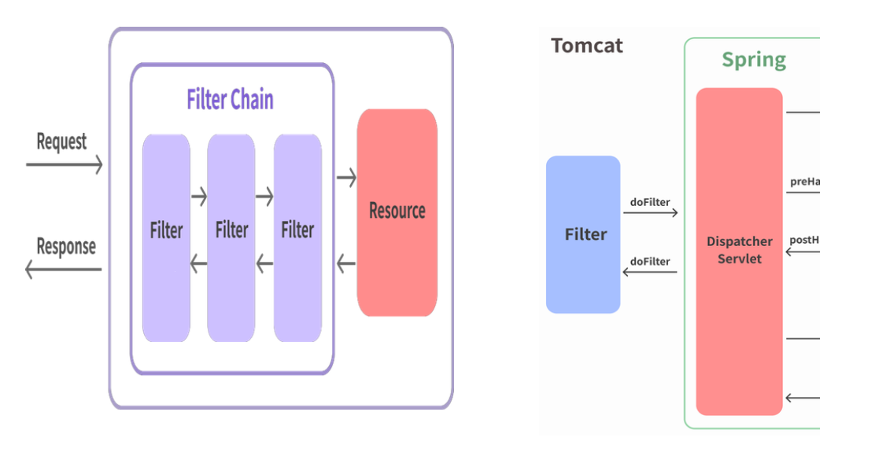

### Spring scheduler

Application 클래스에서 @EnableScheduling 어노테이션을 넣어서, 스케줄링 기능을 사용할 수 있다.

```java
@EnableScheduling // 스케줄링 기능을 enable 함
@SpringBootApplication
public class AnythingTestApplication {
		...
}
```

---

### 필터와 인터셉터

Spring은 공통적인 여러 작업을 대신 처리하며 개발시 중복된 코드를 제거할 수 있도록 많은 기능들을 지원하는데 필터(Filter)와 인터셉터(Interceptor)도 여기에 포함.

### **필터란?**

필터(Filter)는 J2EE 표준 스펙 기능으로 DispatcherServlet(Dispatcher Servlet)에 요청이 전달되기 전/후에 url 패턴에 맞는 모든 요청에 대해 부갖가업을 처리할 수 있는 기능을 제공한다.

DispatcherServlet은 스프링의 가장 앞단에 존재하는 프론트 컨트롤러이므로, 필터는 스프링 범위 밖에서 처리가 되는 것이다.

즉, 스프링 컨테이너가 아닌 톰캣과 같은 웹 컨테이너(서블릿 컨테이너)에 의해 관리가 되는 것이고(스프링 빈으로 등록은 된다), DispatcherServlet 전/후에 처리하는 것이다. 이러한 과정을 그림으로 표현하면 다음과 같다.



### **필터(Filter)의 메서드**

필터를 추가하기 위해서는 javax.servlet의 Filter 인터페이스를 구현(implements)해야 하며 이는 다음의 3가지 메서드를 가지고 있다.

```java
public interface Filter {
	public default void init(FilterConfig filterConfig) throws ServletException {
	} 
	public void doFilter(ServletRequest request, ServletResponse response, FilterChain chain) throws IOException, ServletException {
	}
	public default void destroy() {
	} 
}
```

**interface에서 default로 지정해주면 @Override는 선택. default로 지정해주지 않으면 필수.**

- init 메서드
init 메서드는 필터 객체를 초기화하고 서비스에 추가하기 위한 메서드다. 웹 컨테이너가 1회 init
메서드를 호출하여 필터 객체를 초기화하면 이후의 요청들은 doFilter를 통해 처리된다.
- doFilter 메서드
doFilter 메서드는 url-pattern에 맞는 모든 HTTP 요청이 DispatcherServlet으로 전달되기 전에
웹 컨테이너에 의해 실행되는 메서드다. doFilter의 파라미터로는 FilterChain이 있는데,
FilterChain의 doFilter 통해 다음 대상으로 요청을 전달하게 된다. chain.doFilter() 전/후에 우리가
필요한 처리 과정을 넣어줌으로써 원하는 처리를 진행할 수 있다.
- destroy 메서드
destroy 메서드는 필터 객체를 서비스에서 제거하고 사용하는 자원을 반환하기 위한 메서드다. 이는
웹 컨테이너에 의해 1번 호출되며 이후에는 이제 doFilter에 의해 처리되지 않는다.

### 필터의 등록

```java
@Component
@Slf4j
@Order(2)
public class TestFilter1 implements Filter {
	public void doFilter(ServletRequest request, ServletResponse response, FilterChain chain)throws IOException, ServletException{ 
		log.info("[필터1] 요청 자원 수행 전");
		chain.doFilter(request, response);
		log.info("[필터1] 요청 자원 수행 후"); 
	}
}
```

---

### 인터셉터(Interceptor)란?

인터셉터(Interceptor)는 J2EE 표준 스펙인 필터(Filter)와 달리 Spring이 제공하는 기술로써,
DispatcherServlet(Dispatcher Servlet)이 컨트롤러를 호출하기 전과 후에 요청과 응답을 참조하거나 가공할 수 있는 기능을 제공한다.

웹 컨테이너(서블릿 컨테이너)에서 동작하는 필터와 달리 인터셉터는 스프링 컨텍스트에서 동작을 하는 것이다. DispatcherServlet은 핸들러 매핑을 통해 적절한 컨트롤러를 찾도록 요청하는데, 그 결과로 실행 체인(HandlerExecutionChain)을 리턴해 준다. 이 실행 체인은 1개 이상의 인터셉터가 등록되어 있다면 순차적으로 인터셉터들을 거쳐 컨트롤러가 실행되도록 하고, 인터셉터가 없다면 바로 컨트롤러를 실행한다. 인터셉터는 스프링 컨테이너 내에서 동작하므로 필터를 거쳐 프론트 컨트롤러인 DispatcherServlet이 요청을 받은 이후에 동작하게 되는데, 이러한 호출 순서를 그림으로 표현하면 다음과 같다.


### 인터셉터(Interceptor)의 메서드

인터셉터를 추가하려면 org.springframework.web.servlet의 HandlerInterceptor 인터페이스를 구현(implements)해야 하며, 이는 다음의 3가지 메서드를 가지고 있다.

```java
public interface HandlerInterceptor {
	default boolean preHandle(HttpServletRequest request, HttpServletResponse response, Object handler) throws Exception { 
	return true;
	}
	default void postHandle(HttpServletRequest request, HttpServletResponse response, Object handler, @Nullable ModelAndView modelAndView) throws Exception { 
	}
	default void afterCompletion(HttpServletRequest request, HttpServletResponse response, Object handler, @Nullable Exception ex) throws Exception {
	} 
}
```

모두 default interface이기 때문에 @Override는 선택이다.

- **preHandle() 메서드**
preHandle 메서드는 컨트롤러가 호출되기 전에 실행된다. 그렇기 때문에 컨트롤러 이전에 처리해야
하는 전처리 작업이나 요청 정보를 가공하거나 추가하는 경우에 사용할 수 있다.
    
    preHandle의 3번째 파라미터인 handler 파라미터는 핸들러 매핑이 찾아준 컨트롤러 빈에 매핑되는
    HandlerMethod라는 새로운 타입의 객체로써, @RequestMapping이 붙은 메서드의 정보를
    추상화한 객체이다. 또한 preHandle의 반환 타입은 boolean인데 반환 값이 true이면 다음 단계로
    진행이 되지만, false라면 작업을 중단하여 이후의 작업(다음 인터셉터 또는 컨트롤러)은 진행되지
    않는다.
    
- **postHandle() 메서드**
postHandle 메서드는 컨트롤러를 호출된 후에 실행된다. 그렇기 때문에 컨트롤러 이후에 처리해야
하는 후처리 작업이 있을 때 사용할 수 있다. 이 메서드에는 컨트롤러가 반환하는 ModelAndView
타입의 정보가 제공되는데, 최근에는 Json 형태로 데이터를 제공하는 RestAPI 기반의
컨트롤러(@RestController)를 만들면서 자주 사용되지는 않는다. 또한 컨트롤러 하위 계층에서
작업을 진행하다가 중간에 예외가 발생하면 postHandle은 호출되지 않는다.
- **afterCompletion() 메서드**
afterCompletion 메서드는 이름 그대로 모든 뷰에서 최종 결과를 생성하는 일을 포함해 모든
작업이 완료된 후에 실행된다. 요청 처리 중에 사용한 리소스를 반환할 때 사용하기에 적합하다.
postHandler과 달리 컨트롤러 하위 계층에서 작업을 진행하다가 중간에 예외가 발생하더라도
afterCompletion은 반드시 호출된다.

**postHandle : preHandle이 정상적으로 수행되었을 때(return true)만 수행된다.**

**afterCompletion : 컨트롤러 예외 발생시에도 수행된다.**

### 인터셉터의 등록

```java
package com.example.springedu.config;
import com.example.springedu.interceptor.TestInterceptor;
import org.springframework.context.annotation.Configuration;
import org.springframework.web.servlet.config.annotation.InterceptorRegistry; import org.springframework.web.servlet.config.annotation.WebMvcConfigurer;

@Configuration
public class WebMvcConfig implements WebMvcConfigurer {
	@Override
	public void addInterceptors(InterceptorRegistry registry) {
		registry.addInterceptor(new TestInterceptor()).addPathPatterns("/hello");
		/* registry.addInterceptor(인터셉터객체)
				.addPathPatterns("/*") - 모든 Path 적용 
				.addPathPatterns("/sample") - /sample Path 에 대해서만 적용 
				.excludePathPatterns("/sample"); - /sample Path 에 대해서만 제외
		*/ 
	}
}
```

---

### **인터셉터와 필터의 차이는?**


- 필터는 자바(Java)가 지원하는 기능, 인터셉터는 스프링(Spring)이 지원하는 기능.
- 필터는 WebApplication에서 동작하고, 인터셉터는 Spring Context에서 동작.
    - 필터에서 발생하는 예외는 WebApplication에서 처리.
- 필터는 Dispatcher Servlet보다도 앞에서 동작할 수 있다.
    - ServletRequest, ServletResponse를 받아서 처리하는 것이 가능.
- 인터셉터는 필터랑 달리 컨트롤러가 동작한 후에 작업을 처리할 수 있다.
    - ex. ViewController에서 뷰를 생성한 것에 따라 동적으로 처리하는 일이 가능.

---

### 오류 처리 [@ExceptionHandler, @ControllerAdvice]

@ExceptionHandler : 스프링 MVC에서는 에러나 예외를 처리하기 위한 특별한 방법을 제공하는 데 @ExceptionHandler 어노테이션을 이용하면 된다. 스프링 컨트롤러에서 정의한 메서드 (@RequestMapping)에서 기술한 예외가 발생되면 자동으로 받아낼 수 있다. 이를 이용하여 컨트롤 러에서 발생하는 예외를 View단인 JSP등으로 보내서 처리할 수 있다.

@ControllerAdvice : @ControllerAdvice는 스프링 3.2 이상에서 사용가능 하며 @Controller나 @RestController 에서 발생하는 예외 등을 catch하는 기능을 가지고 있다. 클래스 위에 @ControllerAdvice를 붙이고 어떤 예외를 잡아낼 것인지 내부 메서드를 선언하여 메서드 상단에 @ExceptionHandler(예외클래스명.class)와 같이 기술한다.

**Controller는 단일체계의 원칙을 고수하는것이 좋다.**

---

### 웹 소켓(WebSocket) 프로그래밍

HTML5 표준 기술로, HTTP 환경에서 클라이언트와 서버 사이에 하나의 TCP 연결을 통해 실시간으 로 전이중 통신을 가능하게 하는 프로토콜.

실시간 알림, 실시간 채팅 등 실시간이라는 키워드가 들어가는 기능들을 위해서는 대부분 웹 소켓 기 술이 필요하다.


### 웹 소켓의 통신 방식

웹 소켓은 전 이중 통신이므로, 연속적인 데이터 전송의 신뢰성을 보장하기 위해 Handshake 과정을 진행한다.

기존의 다른 TCP기반의 프로토콜은 TCP layer에서의 Handshake를 통해 연결을 수립하는 반면, 웹 소켓은 HTTP 요청 기반으로 Handshake 과정을 거쳐 연결을 수립한다.

### 웹 소켓 통신의 동작 방식


### 웹 소켓을 이용한 통신의 특징

양방향 통신이 가능하다. 

서버에서 일방적으로 클라이언트로 요청을 보낼 수 있다.

실시간 통신이 가능하다. 

Connection을 유지하고 있는 동안 request-response 방식의 통신이 아닌 아닌 양방향의 실시간 데이터 통신이 가능하다.

### 웹 소켓 통신의 구현

서버와 클라이언트 관계없이 웹 소켓 관련 이벤트 핸들러를 구현하여 처리한다.

```java
Part of WebSocket Interface:
attribute Function onopen:
attribute Function onmessage:
attribute Function onerror:
attribute Function onclose:
```

### 웹 소켓 클라이언트 구현 – 자바스크립트 + HTML5 API

- 서버연결
HTML5가 제공하는 WebSocket 객체를 통해 서버 연결을 수행한다.
일반 통신은 ws, 보안 통신은 wss 프로토콜을 이용한다.
    
    ```java
    let ws = new WebSocket("웹 소켓 URL 문자열");
    ```
    
    웹 소켓 URL 문자열 : ws://서버주소/웹 소켓 서버 프로그램의 매핑명
    
- 데이터 송신
WebSocket 객체의 send() 메서드로 데이터를 서버로 송신한다.
    
    ```java
    ws.send ("전송하려는 메시지")
    ```
    
- 데이터 수신
서버에서 전송되는 데이터를 받으려면 message 이벤트를 구현한다.

```java
ws.onmessage = function(e) {
	e.data로 추출하여 수신받은 메시지 처리
}
```

### 웹 소켓 관련 이벤트

open : 웹 소켓 서버와 접속이 일어나면 발생하는 이벤트이다.

close : 웹 소켓 서버와 접속이 해제되면 발생되는 이벤트이다.

message : 웹 소켓 서버로 부터 메시지가 수신되면 발생되는 이벤트이다.

error : 웹 소켓 오류가 생기면 발생되는 이벤트이다.
```java
let ws = new WebSocket("ws://서버주소/웹 소켓 서버 프로그램의 매핑명");
ws.onopen = function(e) {
//웹 소켓 서버와의 접속이 성공하면 발생하는 open 이벤트의 핸들러
}
ws.onclose = function(e) {
//웹 소켓 서버와의 접속이 해제되면 발생하는 close 이벤트의 핸들러 
}
ws.onerror = function(e) {
//웹 소켓 통신을 하는 동안 발생할 수도 있는 error 이벤트의 핸들러
}
ws.onmessage = function(e) {
//웹 소켓 서버로부터 메시지가 수신되면 발생하는 message 이벤트의 핸들러 
}
```