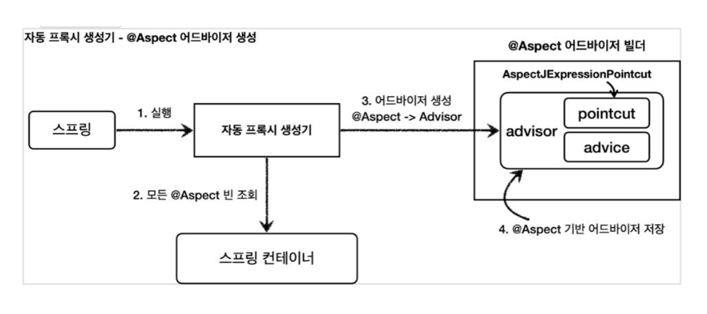

### 관점 지향 프로그래밍(AOP-Aspect Oriented Programming)

어떤 기능을 구현할 때 그 기능을 핵심 기능과 부가 기능으로 구분한 각각의 기능

핵심 기능 : 비즈니스 로직이 처리하려는 목적 기능, 회원서비스, 커뮤니티서비스, 상품서비스

부가 기능 : 여러 비즈니스 로직 사이에서 공통적이고 반복적으로 필요한 기능, 로깅, 보안, 트랜잭션

**AOP는 어떤 기능을 구현할 때 각각을 하나의 관점으로 보며 그 관점을 기준으로 묶어서 개발하는 방식을 의미한다. 즉, 핵심 기능과 부가 기능을 나눠서 개발하는 것이다.**


여러 비즈니스 로직에 반복되는 부가 기능을 하나의 공통 로직으로 처리하도록 모듈화 하여 삽입하는 방식을 AOP라고 한다.

Spring 의 핵심 개념 중 하나인 DI 가 애플리케이션 모듈들 간의 결합도를 낮춘다면, AOP(Aspect- Oriented Programming)는 핵심 로직과 부가 기능(공통 로직)을 분리하여 애플리케이션 전체에 걸쳐 사용되는 부가 기능을 모듈화 하여 재사용할 수 있도록 지원하는 것이다.

부가기능 관점에서 바라보면 각 Service 의 getXxx() 메서드를 호출하는 전후에 before()와 after()
라는 메서드가 공통으로 사용되는 것을 확인할 수 있다.
기존에 OOP 에서 바라보던 관점을 다르게 하여 부가 기능적인 측면에서 보았을 때 공통된 요소를 분리하자는 것이다. 이때 가로(횡단) 영역의 공통된 부분을 잘라냈다고 하여, AOP 를 크로스라고 부르기도 한다.

### AOP 용어


|||
|---|---|
| JoinPoint | 추상적인 개념으로 advice 가 적용될 수 있는 모든 위치를 말한다. ex) 메서드 실행 시점, 생성자 호출 시점, 필드 값 접근 시점 등등.. 스프링 AOP 는 프록시 방식을 사용하므로 조인 포인트는 항상 메서드 실행 시점 |
| Pointcut | 조인 포인트 중에서 advice 가 적용될 위치를 선별하는 기능. 스프링 AOP는 프록시 기반이기 때문에 조인 포인트가 메서드 실행 시점 뿐이 없고 포인트컷도 메서드 실행 시점만 가능 |
| Target | advice 의 대상이 되는 객체. Pointcut 으로 결정됨 |
| Advice | 실질적인 부가 기능 로직을 정의하는 곳. 특정 조인 포인트에서 Aspect 에 의해 취해지는 조치 |
| Aspect | Advice + Pointcut 을 모듈화 한 것. @Aspect 와 같은 의미 |
| Advisor | 스프링 AOP 에서만 사용되는 용어로 Advice + Pointcut 한 쌍 |
| Weaving | Pointcut 으로 결정한 타겟의 JoinPoint 에 Advice 를 적용하는 것 |
| AOP 프록시 | AOP 기능을 구현하기 위해 만든 프록시 객체. 스프링에서 AOP 프록시는 JDK 동적 프록시 또는 CGLIB 프록시 스프링 부트 2.0 부터 스프링 AOP 의 기본값은 CGLIB 프록시 |

### @Aspect

Advice + pointcut

@Aspect 애노테이션 을 사용한다면 Advisor 를 더욱 쉽게 구현할 수 있다. 스프링 AOP 를 사용하기 위해서는 다음과 같은 의존성을 추가해야 한다.



### Advice

Advice 는 실질적으로 프록시에서 수행하게 되는 로직을 정의하게 되는 곳.

@Around (매개변수는 반드시 정의되어야 한다)

- 다른 4 가지 애노테이션을 모두 포함하는 애노테이션
- 메서드 호출 전후 작업 명시 가능
- 조인 포인트 실행 여부 선택 가능
- 입력 값 및 반환 값 변경이나 예외 처리 조작 가능
- 조인 포인트를 여러 번 실행 가능(재시도)

@Before

- 조인 포인트 실행 이전에 실행(실제 target 메서드 수행 전에 실행)
- 입력 값 자체는 변경할 수 없지만 입력 값의 내부에 setter 같은 수정자가 있다면 내부 값은 수정 가능

@AfterReturning

- 조인 포인트가 정상 완료 후 실행(실제 target 메서드 수행 완료 후 실행)
- 반환 값 자체는 변경할 수 없지만 반환 값의 내부에 setter 같은 수정자가 있다면 내부 값은 수정 가능

@AfterThrowing

- 메서드가 예외를 던지는 경우 실행(실제 target 메서드가 예외를 던지는 경우 실행)
- 예외 조작 불가능

@After

- 조인 포인트의 정상, 예외 동작과 무관하게 실행 (실제 target 메서드가 정상적 수행을 하든 예외를 던지든 수행 이후에 무조건 실행)

JoinPoint 인터페이스가 제공하는 주요 메서드의 기능은 다음과 같다.

getArgs() : 메서드 인수 반환

getThis() : 프록시 객체 반환

getTarget() : 대상 객체 반환
getSignature() : 조인되는 메서드에 대한 설명 반환
toString() : 조인되는 방법에 대한 유용한 설명 인쇄

```java
@Aspect : Aspect 클래스 선언
@Before("pointcut")
@AfterReturning(pointcut="", returning="") 
@AfterThrowing(pointcut="", throwing="")
@After("pointcut")
@Around("point") : 전반적
```

### 어노테이션 동작 순서

**Around -> Before -> AfterThrowing -> AfterReturning -> After -> Around**


### Advice 순서 지정하기

애노테이션의 동작 순서는 정의되어 있더라도, 같은 애노테이션에 대한 동작 순서는 보장되지 않는다.

순서를 보장하고 싶다면 @Aspect 적용 단위로 @Order 애노테이션 을 지정해야 한다. 즉, Advice 단위가 아니라 @Aspect 클래스 단위로만 지정이 가능한다. 따라서 하나의 Aspect 안에 여러 Advice 가 존재한다면 처리 순서를 보장할 수 없어 별도의 @Aspect 이 정의된 클래스로 분리해야 한다.
```java
@Aspect
@Order(1)
public static class TxAspect {
	@Around("hello.aop.order.aop.Pointcuts.orderAndService()")
	public Object doTx(ProceedingJoinPoint joinPoint) throws Throwable {
	// 생략 
	}
}
@Aspect
@Order(2)
public static class LogAspect {
	@Around("hello.aop.order.aop.Pointcuts.allOrder()")
	public Object doLog(ProceedingJoinPoint joinPoint) throws Throwable {
	// 생략 
	}
}
```
