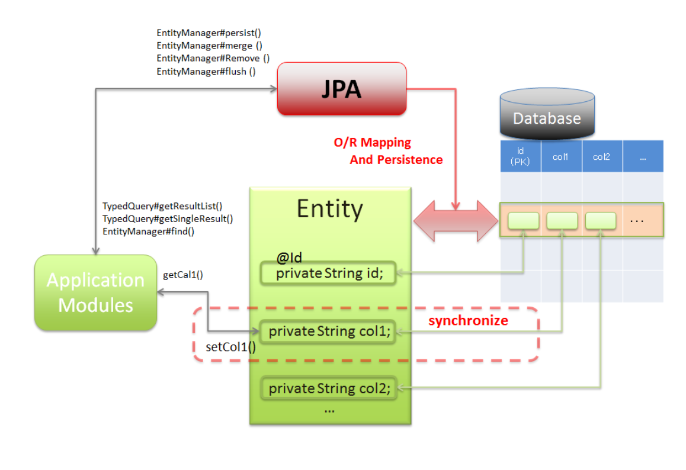
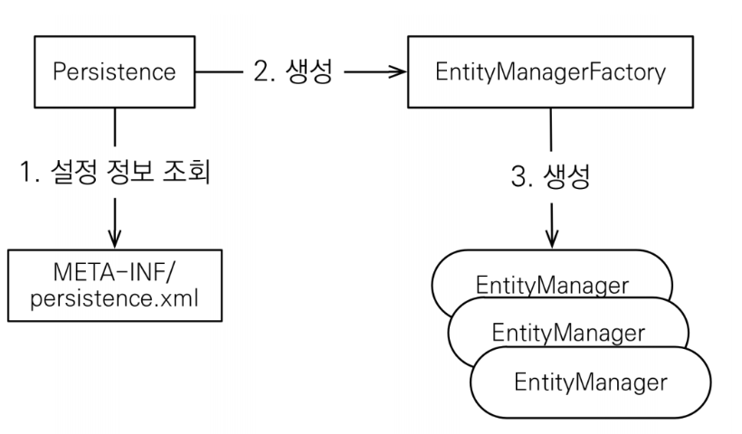
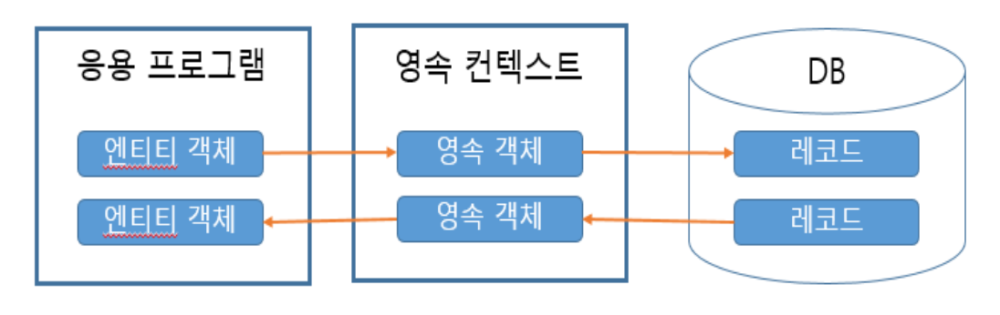
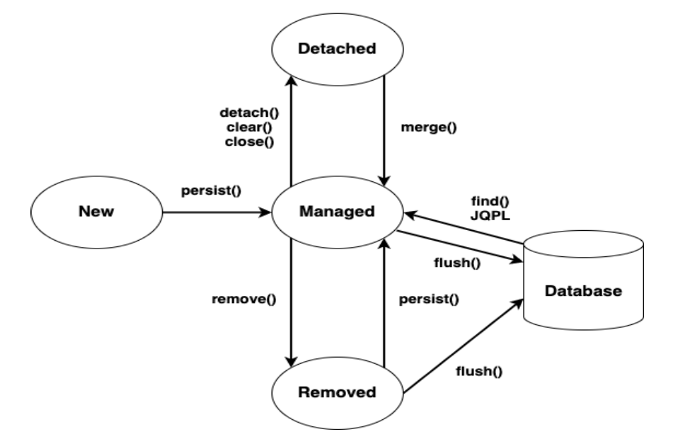
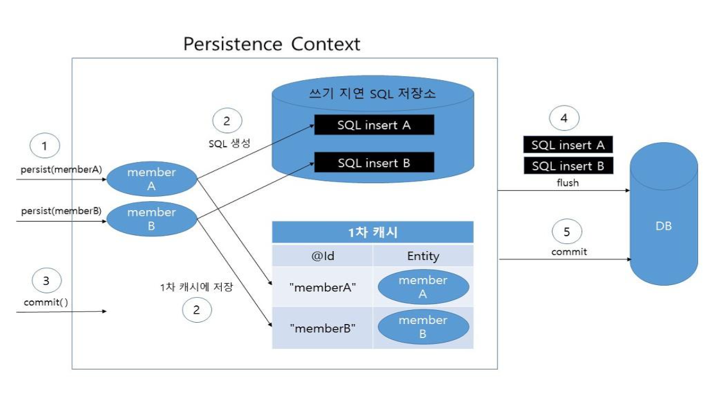
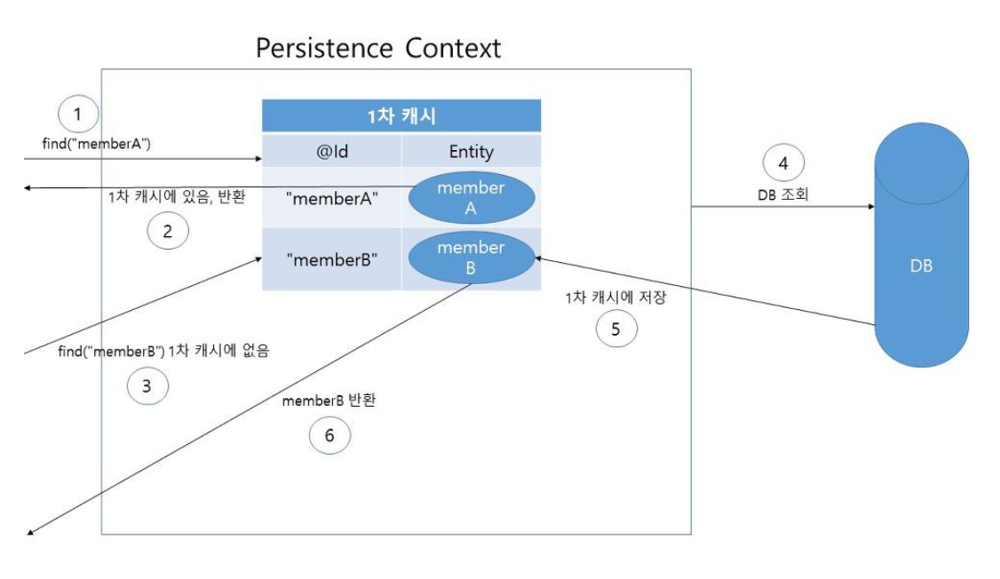

### JPA 개념

JPA는 Java Persistence API 의 약자로서, RDBMS와 OOP 객체 사이의 불일치에서 오는 패러다임 을 해결하기 위해서 만들어진 ORM(Object-Relational Mapping) 기술이다.

ORM이란 Object Relational Mapping, 객체-관계 매핑의 줄임말로서 OOP의 객체 구현 클래스와 RDBMS에서 사용하는 테이블을 자동으로 매핑하는 것을 의미한다.

JPA 는 자바 ORM에 대한 API 표준 명세이고, 인터페이스의 모음이다. 따라서 구현체가 없으므로, 사용하기 위해서는 ORM프레임워크를 선택해야한다. 다양한 프레임워크가 존재하지만 가장 대중적 인 것은 하이버네이트이다.


JPA를 통하여 하이버네이트를 공부한다.

---

### Persistence Framework



JDBC 프로그래밍에서 경험하게 되는 복잡함이나 번거로움 없이 간단한 작업만으로 데이터베이스와 연동되는 시스템을 빠르게 개발할 수 있다. 일반적으로 SQL Mapper와 ORM으로 나눠진다.
**SQL Mapper**

SQL <-> SQL Mapper <-> Object 필드
직접 작성한 SQL 문장으로 데이터베이스 데이터를 다룬다.
Mybatis, JdbcTemplates(Spring)

**ORM**

Database data <-> ORM <-> Object 필드
객체를 통해서 간접적으로 데이터베이스의 데이터를 다룬다.
객체와 관계형 데이터베이스의 데이터를 자동으로 맵핑시킨다.
JPA, Hibernate 등

---

### JPA의 사용이점

**1. 생산성**
JPA를 사용하면 자바 컬렉션에 저장하듯이 JPA에게 저장할 객체를 전달하면 된다.

지루하고 반복적인 코드를 개발자가 직접 작성하지 않아도 되며, DDL문도 자동으로 생성해주기 때문에 데이터베이스 설계 중심을 객체 설계 중심으로 변경할 수 있다.

**2. 유지보수**
필드를 하나만 추가해도 관련된 SQL과 JDBC 코드를 전부 수행해야 했지만 JPA는 이를 대신 처리해주기 때문에 개발자가 유지보수해야 하는 코드가 줄어든다.

**3. 패러다임의 불일치 해결**
JPA는 연관된 객체를 사용하는 시점에 SQL을 전달할 수 있고, 같은 트랜잭션 내에서 조회할 때 동일성도 보장하기 때문에 다양한 패러다임의 불일치를 해결한다.

**4. 성능**
애플리케이션과 데이터베이스 사이에서 성능 최적화 기회를 제공한다. 

같은 트랜잭션안에서는 같은 엔티티를 반환하기 때문에 데이터 베이스와의 통신 횟수를 줄일 수 있다. 또한, 트랜잭션을 commit하기 전까지 메모리에 쌓고 한 번에 SQL을 전송한다.

**5. 데이터 접근 추상화와 벤더 독립성**

RDB는 같은 기능이라도 벤더마다 사용법이 다르기 때문에 처음 선택한 데이터베이스에 종속되고 변경이 어렵다. 

JPA는 애플리케이션과 데이터베이스 사이에서 추상화된 데이터 접근을 제공하기 때문에 종속이 되지 않도록 한다. 만약 DB가 변경되더라도 JPA에게 알려주면 간단하게 변경이 가능하다.

---

### JPA 프로그래밍



**EntityManagerFactory**
데이터베이스와 상호 작용을 위한 EntityManager 객체를 생성하기 위해 사용되는 객체로서 애플리케이션에서 한 번만 생성하고 공유해서 사용한다.

**EntityManager**

Entity를 영속성 컨텍스트(Persistence Context)를 통해 관리하는 객체이다.
데이터베이스에 대한 CRUD 작업은 모두 영속성 컨텍스트를 사용하는 EntityManager 객체를 통해 이루어진다.

동시성의 문제가 발생할 수 있으니 스레드 간에 공유하지 않는다, 모든 데이터 변경은 트랜잭션 안에서 이루어져야 한다.(트랜잭션을 시작하고 처리해야 함)

트랜잭션 : 데이터베이스의 논리적인 작업 단위

```java
flush() 
영속성 컨텍스트(Persistence Context)의 변경 내용을 데이터베이스에 반영한다.
일반적으로는 flush() 메서드를 직접 사용하지는 않고, 자바 애플리케이션에서 커밋 명령이 들어왔을 때 자동으로 실행된다.

detach()
특정 Entity를 준영속 상태(영속 컨텍스트의 관리를 받지않음)로 바꾼다.

clear()
Persistence Context를 초기화한다.

close()
Persistence Context를 종료한다.

merge()
준영속 상태의 엔티티를 이용해서 새로운 영속 상태의 엔티티를 반환한다.

find()
식별자 값을 통해 Entity를 찾는다.(DB 테이블의 데이터 또는 행을 찾는다.)

persist()
생성된 Entity 객체를 영속성 컨텍스트(Persistence Context)에 저장한다.

remove()
식별자 값을 통해 영속성 컨텍스트(Persistence Context)에서 Entity 객체를 삭제한다.
```

---

### Entity

JPA에서 엔티티란 DB 테이블에 대응하는 하나의 객체라고 생각할 수 있다.

@Entity가 붙은 클래스는 JPA에서 엔티티라고 불리며, 영속성 컨텍스트에 담겨 EntityManager가 관리한다.



```java
@Entity
public class EntityTest { 
	@Id
	@GeneratedValue(strategy = GenerationType.IDENTITY)
	private int id;
	private String name; 
	private int age; 
	private LocalDateTime birthday;
	
	public int getId() { 
		return id;
	}
	public void setId(int id) {
		this.id = id; 
	}
	public String getName() { 
		return name;
	}
	public void setName(String name) {
		this.name = name; 
	}
:
```

@GeneratedValue(strategy = GenerationType.IDENTITY)는 AutoIncrement와 같다.

---

### 영속성 컨텍스트(persistence context)

어플리케이션과 데이터베이스 사이에 존재하는 논리적인 개념으로 엔티티를 저장하는 환경.

EntityManager를 통해서만 접근 가능.

영속성 컨텍스트에 존재하는 엔티티는 플러시 호출 시 데이터베이스에 반영됨.

---

### **엔티티 생명주기**



Entity에는 아래와 같은 4가지의 상태가 존재한다.

1. 비영속(new/transient): 영속성 컨텍스트와 전혀 관계가 없는 상태

2. 영속(managed): 영속성 컨텍스트에 저장된 상태

3. 준영속(detached): 영속성 컨텍스트에 저장되었다가 분리된 상태

4. 삭제(removed): 삭제된 상태

---

### 엔티티 생성과 저장



1. 자바 어플리케이션에서 어떤 엔티티 객체를 생성하여 JPA에게 데이터베이스 저장을 부탁하면,

2. 만들어진 엔티티는 1차적으로 영속성 컨텍스트에 저장된다. 1차 캐시 정도라고 생각하면 된다. 그리고, 저장한 엔티티를 데이터베이스에 저장하기 위한 쿼리문을 생성시켜 쓰기 지연 SQL 저장소에 저장한다. 계속해서 엔티티를 넘기면 엔티티들과 쿼리문들은 차곡차곡 영속성 컨텍스트에 저장된다.

3. 자바 어플리케이션에서 커밋 명령이 내려지면 영속 컨텍스트에는 자동으로 flush( )가 호출되고,

4. 영속성 컨텍스트의 변경내용을 데이터베이스와 동기(flush)화 한다(SQL 저장소의 쿼리를 실행시킨다).

5. 마지막으로 데이터베이스에게 commit 쿼리문을 명령한다.

**3번에서의 commit과 5번에서의 commit은 다른 commit이다.**

---

### 엔티티 조회



1. 자바 어플리케이션에서 JPA에게 데이터베이스 조회를 부탁하면, 1차적으로 영속성 컨텍스트에서 엔티티를 찾는다.

2. 있으면 자바 어플리케이션에 엔티티를 넘긴다.

3. 영속성 컨텍스트에 없는 엔티티 조회를 부탁하면

4. 쿼리문을 사용해 데이터베이스에서 찾아와

5. 영속성 컨텍스트에 엔티티로 저장하고

6. 자바 어플리케이션에 그 엔티티를 넘긴다.

```java
EntityManager em = factory.createEntityManager(); 
TypedQuery<Visitor> q = em.createQuery(
												"select t from Visitor t WHERE t.memo like :keyword", Visitor.class); 
q.setParameter("keyword", "%" + keyword + "%");
// " " : 동적
List<Visitor> list = q.getResultList(); em.close();
```

---

### JPQL 구문

엔티티 객체를 조회하는 객체지향 쿼리이며 SQL은 데이터베이스 테이블을 대상으로 JPQL은 엔티티 객체를 대상으로 쿼리 한다.

### JPQL 기본 문법

```java
select_문 :: =
	select_절 from_절 [where_절] [groupby_절] [having_절] [orderby_절]
```

**(1) Query 문**

```java
select m from Member as m where m.username = 'Hello'
```

엔티티와 속성은 대소문자를 구분하고 JPQL 키워드는 대소문자를 구분하지 않는다.

JPQL에서 사용한 Member는 테이블 명, 클래스 명이 아니라 엔티티 명이다. 엔티티 명은 @Entity(name = "")로 지정할 수 있다.
[ 별칭 ]

"Member as m"을 보면 Member에 m이라는 별칭을 사용했다. JPQL은 별칭이 필수이다. (as는 생략 가능)

**(2) 집합**

```java
groupby_절 :: = 
	GROUP BY {단일값 경로 | 별칭} having_절 :: = HAVING 조건식
select t.name from Member m LEFT JOIN m.team t GROUP BY t.name Having AVG(m.age) >= 10
```

**집합 함수**

```java
COUNT : 결과 수를 구한다. 반환 타입 : Long
MAX, MIN : 최대, 최소 값을 구한다. 문자, 숫자, 날짜 등에 사용한다. 
AVG : 평균값을 구하며 숫자타입만 사용할 수 있다. 반환 타입 : Double
SUM : 합을 구하며 숫자타입만 사용할 수 있다.

NULL 값은 무시하므로 통계에 잡히지 않는다.
DISTINCT를 집합 함수 안에 사용해서 중복된 값을 제거하고 나서 집합을 구할 수 있다. 
select COUNT( DISTINCT m.age ) from Member m
```

**(3) 정렬**

```java
ORDER BY : 결과를 정렬할 때 사용한다. ASC : 오름차순(기본값)
DESC : 내림차순
orderby_절 ::=
	ORDERBY{ 상태필드 경로 | 결과 변수 [ASC|DESC]} 
select m from Member m order by m.age DESC, m.username ASC
```

**(4) 서브 쿼리**

```java
select m from Member m where m.age > (select avg(m2.age) from Member m2)

- EXISTS
//teamA 소속인 회원
select m from Member m where exists (select t from m.team t where t.name = 'teamA')

- {ALL | ANY | SOME}
//전체 상품 각각의 재고보다 주문량이 많은 주문들
select o from Order o where o.orderAmount > ALL
(select p.stockAmount from Product p)

- [NOT] IN
//20세 이상을 보유한 팀
select t from Team t where t IN
(select t2 from Team t2 join t2.members m2 where m2.age >= 20)
```

- EXISTS
    
    문법 : [NOT] EXISTS (subquery)
    
    설명 : 서브 쿼리에 결과가 존재하면 참이다. NOT은 반대
    
- {ALL | ANY | SOME}
    
    문법 : {ALL | ANY | SOME} (subquery)
    
    설명 : 비교 연산자와 같이 사용한다.{=|>|>=|<|<=|<>}
    
    All : 조건을 모두 만족하면 참이다.
    
    ANY or SOME : 둘은 같은 의미다. 조건을 하나라도 만족하면 참이다.
    
- [NOT] IN
    
    문법 : [NOT] IN (subqeury)
    
    설명 : 서브 쿼리의 결과 중 하나라도 같은 것이 있으면 참이다. IN은 서브 쿼리가 아닌 곳에서도 사용한다.
    

**(5) 쿼리 객체**

작성한 JPQL을 실행하려면 쿼리 객체를 만들어야 한며 쿼리 객체는 TypeQuery와 Query 두 가지가 있다.

- TypeQuery : 반환할 타입을 명확하게 지정할 수 있을 때 사용.

```java
TypedQuery<Member> query = em.createQuery("select m from Member as m", Member.class);
List<Member> members = em.createQuery(query, Member.class).getResultList();
members.stream().forEach(System.out::println);
```

- Query : 반환 타입을 명확하게 지정할 수 없을 때 사용.
    
    Query객체는 조회 대상이 둘 이상이면 Object[]를 반환하고 조회 대상이 하나면 Object를 반환.
    
    ```java
    Query query = em.createQuery("select m.username, m.age from Member m");
    ```
    

```java
List<Object[]> resultList = query.getResultList();
for (Object[] objects : resultList) {
String userName = (String) objects[0]; Integer age = (Integer) objects[1];
}
List resultList = query.getResultList(); for (Object o : resultList) {
Object[] objects = (Object[]) o;
String userName = (String) objects[0]; Integer age = (Integer) objects[1];
}
```

**(6) 결과 조회 API**

- query.getResultList()
    
    결과가 하나 이상 일 때 또는 몇 개일지 예측할 수 없을 때 사용. 결과가 없으면 빈 리스트 반환
    

```java
TypedQuery<Member> query = em.createQuery("select m from Member as m", Member.class);
List<Member> resultList = query.getResultList();
```

- query.getSingleResult()
    
    결과가 정확히 하나, 단일 객체 반환
    
    결과가 없으면 : javax.persistence.NoResultException
    
    둘 이상이면 : javax.persistence.NonUniqueResultException
    

```java
TypedQuery<Member> query = em.createQuery(
	"select m from Member as m where m.id = 1L", Member.class);
Member result = query.getSingleResult();
```

---

### JPA 기본키 매핑

기본키(primary key)를 매핑하는 방법은 2가지로 직접 할당과 자동 생성이 있다. 직접 할당은 엔티티에 @Id 어노테이션만 사용해서 직접 할당하는 것이다. 자동 생성은 엔티티에 @Id와 @GeneratiedValue를 추가하고 원하는 키 생성 전략을 선택한다.

자동 생성같은 경우에는 MySQL의 AUTO_INCREMENT 같은 기능으로 생성된 값을 기본키로 사용하는 것이다.

IDENTITY : 기본키 생성을 DB에 위임한다.

SEQUENCE : DB 시퀀스를 사용해서 기본키를 할당한다.

TABLE : 키 생성 테이블을 사용한다.

AUTO : 선택한 DB에 따라 IDENTITY, SEQUENCE, TABLE 중 하나를 자동으로 선택한다.

기본키 자동 생성 전략 - IDENTITY