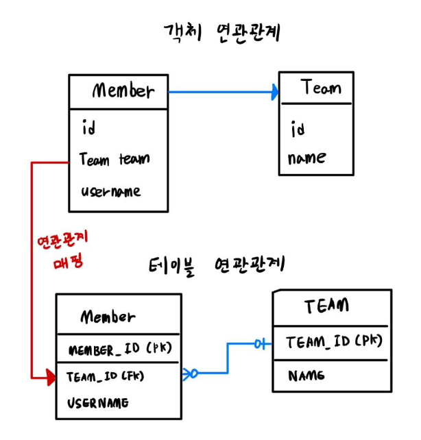
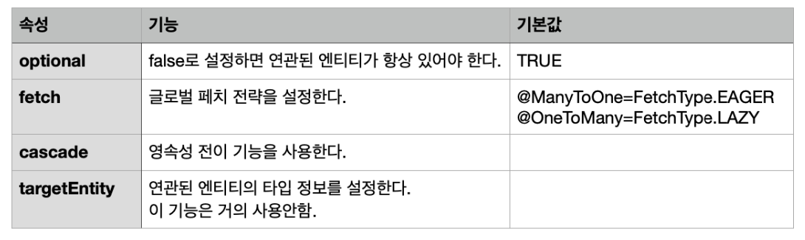

### JPA 연관관계 매핑 기초

엔티티는 다른 엔티티와 연관관계가 대부분 존재한다. 연관관계는 단방향과 양방향이 있다.

회원 → 팀 ( 회원은 팀을 참조한다 ) 

팀 → 회원 ( 팀은 회원을 참조한다 )

위의 두 가지 관계에서 하나만 성립하는 경우 단방향 관계, 두 가지 관계 모두 서로 참조하면 양방 향 관계라고 한다.



### 다대일(N:1) 연관관계, 단방향

객체간의 연관관계에서는 단방향 관계이므로 member → team 조회는 가능하지만 반대의 경우는 할 수 없다. Member.team 필드를 통해서 팀을 알 수 있지만, 반대로 팀은 회원을 알 수 없다.

테이블 연관관계에서는 양방향 관계가 가능하므로 양쪽 조회가 가능하다. MEMBER 테이블의 TEAM_ID 외래키로 MEMBER JOIN TEAM 과 TEAM JOIN MEMBER 둘 다 가능.

- 테이블은 외래키로 연관관계를 맺는다.
- 객체는 참조(주소)로 연관관계를 맺는다.

객체와 테이블의 가장 큰 차이점은 참조를 통한 객체 연관관계는 언제나 단방향이라는 것이다. 객체간에 연관관계를 양방향으로 하려면 반대쪽에도 필드를 추가해서 참조를 보관해야 한다. 즉, 단방향 관계를 반대쪽에서도 만든다. (단방향 2개 == 양방향 1개)

JPA를 사용해서 객체 연관관계와 테이블 연관관계를 매핑하면 위 그림처럼 된다. 회원 객체의 Member.team 필드와 회원 테이블의 MEMBER.TEAM_ID 외래키 컬럼이 매핑되는 것.

```java
// 회원 엔티티
@Entity
public class Member {
	@Id
	@Column(name = "MEMBER_ID") 
	private String id;
	private String username;

	//연관관계 매핑
	@ManyToOne
	@JoinColumn(name = "TEAM_ID")
	private Team team; 
}

// 팀 엔티티
@Entity
public class Team {
	@Id
	@Column(name = "TEAM_ID") 
	private String id;
	
	private String name; 
}
```

**@ManyToOne 이란?**

다대일(N:1) 관계라는 매핑 정보이다. 테이블 연관관계를 보면 회원과 팀의 관계가 N:1로 표현되어 있다.



**@JoinColumn 이란?**

@JoinColumn은 외래키를 매핑할 때 사용한다. name 속성에는 매핑할 외래키 이름을 지정한다. 회원과 팀 테이블은 TEAM_ID 외래키로 연관관계를 맺으므로 이 값을 지정한다.

생략 가능하며 생략한다면 외래키를 찾을 때 기본 전략을 사용하게 된다.
기본 전략 : 필드명 + _ + 참조하는 테이블의 컬럼명 (e.g. team_TEAM_ID 외래키를 사용)