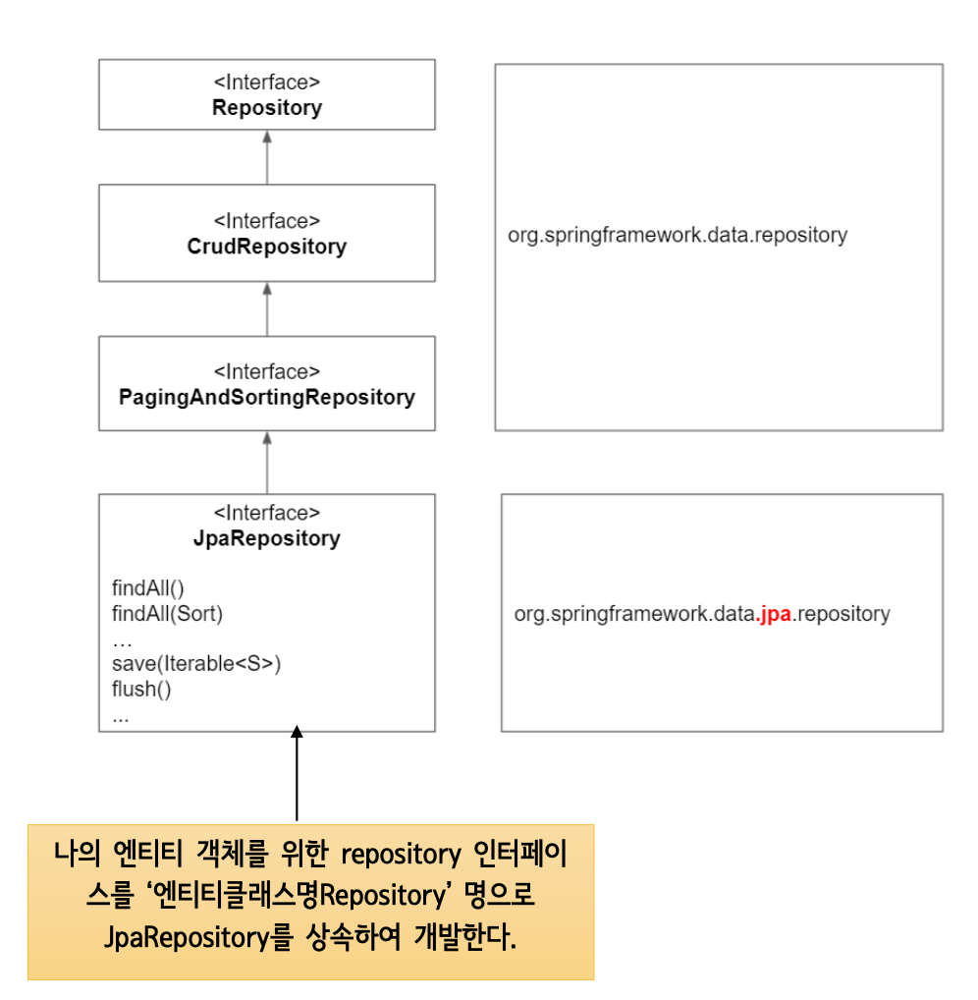
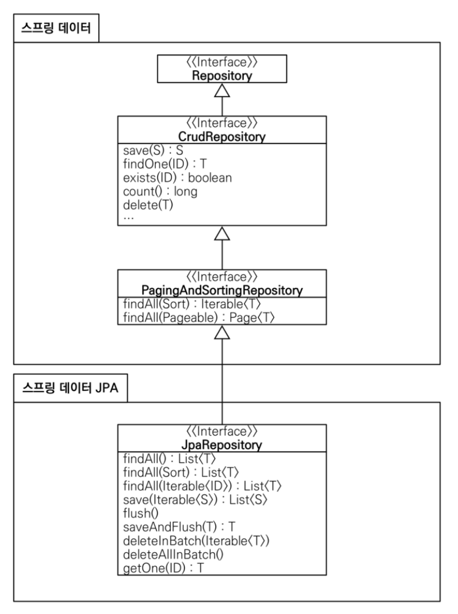
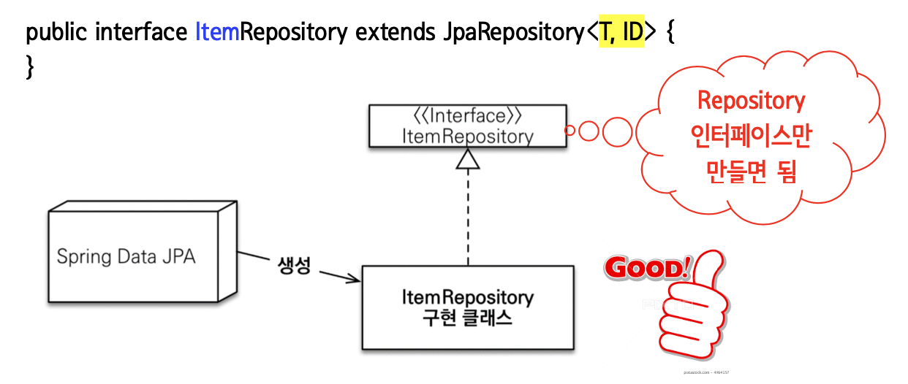
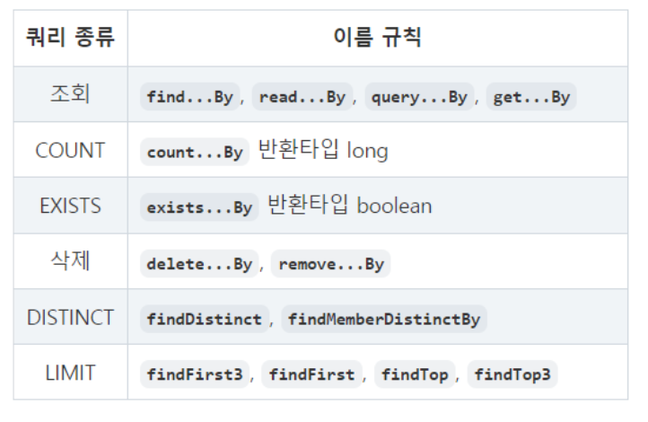

### Spring Data JPA

Spring Data JPA 는 Spring Framework에서 JPA를 편리하게 사용할 수 있도록 지원하는 프로젝트로 CRUD 처리를 위한 공통 인터페이스를 제공한다.

Repository 개발 시 인터페이스만 작성해도 실행 시점에 Spring Data JPA가 구현 객체를 동적으로 생성해서 주입시키므로 데이터 접근 계층을 개발할 때 구현 클래스 없이 인터페이스만 작성해도 개발을 완료할 수 있도록 지원한다.

Spring Data JPA를 사용하기 위해 일반적으로 'JpaRepository<T, ID>' 인터페이스를 상속한 Repository 인터페이스를 정의한다.



### JpaRepository 주요 메서드

| 메서드 | 설명 |
| --- | --- |
| <S extends T> S save(S) | 새로운 엔티티는 저장하고 이미 있는 엔티티는 병합한다. |
| delete(T) | 엔티티 하나를 삭제한다. |
| Optional(T> findById(ID) | ID로 엔티티 하나를 조회한다. |
| List<T> findAll(…) | 모든 엔티티를 조회한다. 정렬(Sort)이나 페이징(Pageable)조건을 파라미터로 제공할 수 있다. |





### 쿼리 메서드

Spring Data JPA는 Repository를 커스터마이징 하기위해 쿼리 메서드 기능을 제공하는데, 3가지 방법이 있다. 

- 메서드 이름으로 쿼리 생성 → 간단한 쿼리 처리 시 좋다.
- @Query 안에 JPQL 정의 → 복잡한 쿼리 처리 시 좋다.
- 메서드 이름으로 JPA NamedQuery 호출 ( 잘 안쓰인다.)



---

### Entitiy int와 Integer 차이

int 는 NOTNULL, Integer은 NULL 가능.

---

**@Autowired :** 필드 인젝션이 필요하다.(Nullpoint exception에서 자유로울 수 없다) → @RequiredArgsConstructor을 사용하고, final 형으로 어노테이션을 주면 자동으로 생성자 메서드를 구현하여 초기화해주기 때문에 Nullpoint exception에서 자유롭다.

```java
@Controller
@RequiredArgsConstructor
public class EmpController {
	//@Autowired
	private final EmpRepository dao;
}
```

생성자 메서드로 구현 : 필드 인젝션이 따로 필요없다.

```java
@Controller
public class EmpController {
	private EmpRepository repository;

	public EmpController(EmpRepository repository) {
		this.repository = repository;
	}
}
```

### @Transactional

read 만 있는 경우에는 사용하지 않지만, insert, update 혹은 delte가 있다면 @Transactional을 반드시 사용해주어야한다. 즉 변경되는 데이터가 있다면 사용하는 어노테이션이다.

### Optional

Optional<T> 클래스를 사용해 NPE를 방지할 수 있도록 도와준다. Optional<T>는 null이 올 수 있는 값을 감싸는 Wrapper 클래스로, 참조하더라도 NPE가 발생하지 않도록 도와준다. Optional 클래스는 아래와 같은 value에 값을 저장하기 때문에 값이 null이더라도 바로 NPE가 발생하지 않으며, 클래스이기 때문에 각종 메소드를 제공

---

### Spring Boot Application 에 설정된 어노테이션 설명

```java
@SpringBootApplication 
@ComponentScan(basePackages={"com.example.demo","thymeleaf.exam", "springjpa.exam"})
@EnableJpaRepositories(basePackages = {"springjpa.exam.repository"}) 
@EntityScan(basePackages = {"springjpa.exam.entity"})
```

- @SpringBootApplication 어노테이션은 스프링 부트의 가장 기본적인 설정을 선언한다. 내부적으로 @ComponentScan과 @EnableAutoConfiguration(자동초기화)을 설정한다.
- @ComponentScan 어노테이션은 스프링 3.1부터 도입된 어노테이션이며 스캔 위치를 설정한다.
- @EnableJpaRepositories 어노테이션은 JPA Repository들을 활성화하기 위한 어노테이션이다.
- @EntityScan 어노테이션은 엔티티 클래스를 스캔할 곳을 지정하는데 사용한다.

### Spring Boot 테스트

스프링 부트는 서블릿 기반의 웹 개발을 위한 spring-boot-starter-web, 유효성 검증을 위한 spring-boot-starter-validation 등 spring-boot-starter 의존성을 제공함. 테스트를 위한 spring-boot-starter-test 역시 존재하는데, 다음과 같은 라이브러리들이 포함된다.

Unit 5: 자바 애플리케이션의 단위 테스트를 위한 사실상의 표준 테스트 도구

Spring Test & Spring Boot Test: 스프링 부트 애플리케이션에 대한 유틸리티 및 통합 테스트 지원

AssertJ: 유연한 검증 라이브러리

Hamcrest: 객체 Matcher를 위한 라이브러리

Mockito: 자바 모킹 프레임워크

JSONassert: JSON 검증을 위한 도구

JsonPath: JSON용 XPath

```java
@SpringBootTest
@WebMvcTest 
@DataJpaTest 
@RestClientTest 
@JsonTest 
@JdbcTest 
.........
```