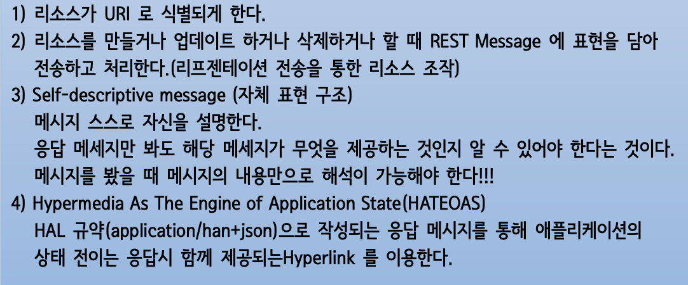
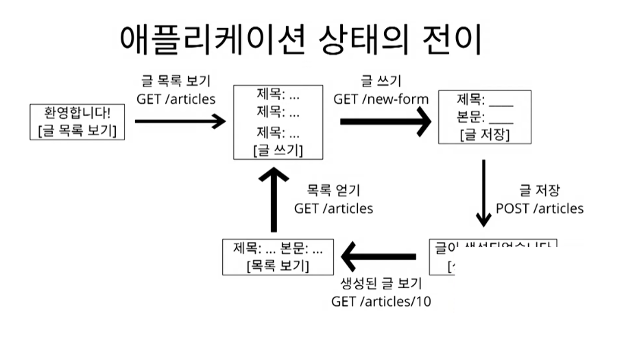
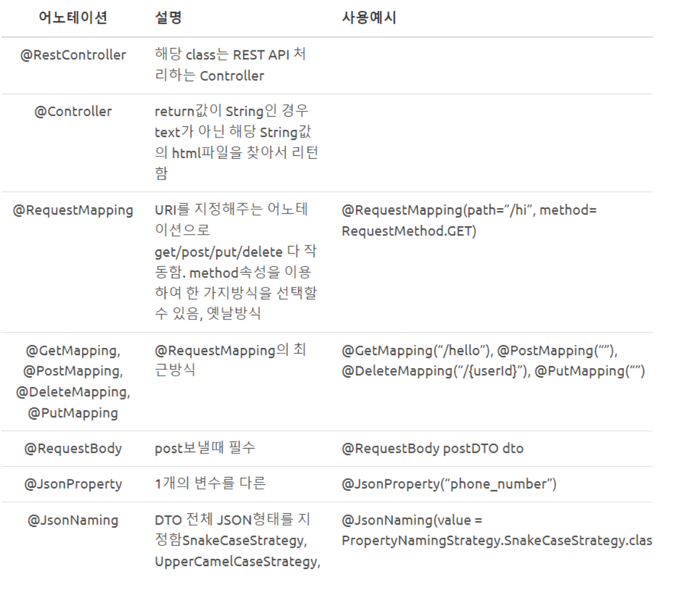
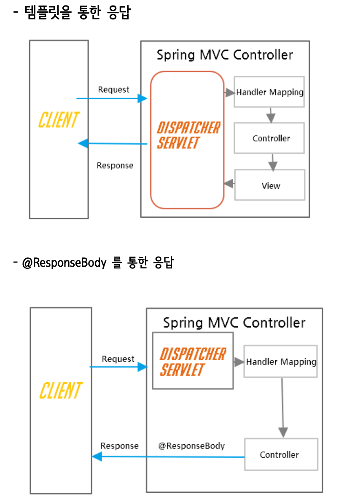

**REST -> 자원을 이름(자원의 표현)으로 구분하여 해당 자원의 상태(정보)를 주고 받는 모든 것**

### REST가 필요한 이유

- 애플리케이션 분리 및 통합
- Web 을 기반으로 하는 C&S 환경의 다양한 프로그램 개발
- 다양한 클라이언트의 등장

### REST 특징

**(1) Server-Client(서버-클라이언트 구조)**

자원이 있는 쪽이 Server, 자원을 요청하는 쪽이 Client가 된다.

REST Server: API를 제공하고 비즈니스 로직 처리 및 저장을 책임진다.

Client: 사용자 인증이나 context(세션, 로그인 정보) 등을 직접 관리하고 책임진다. 서로 간 의존성이 줄어든다.

**(2) Stateless(무상태)**

HTTP 프로토콜은 Stateless Protocol이므로 REST 역시 무상태성을 갖는다. Client의 context를 Server에 저장하지 않는다. 즉, 세션과 쿠키와 같은 context 정보를 신경쓰지 않아도 되므로 구현이 단순해진다. Server는 각각의 요청을 완전히 별개의 것으로 인식하고 처리한다.

각 API 서버는 Client의 요청만을 단순 처리한다. 즉, 이전 요청이 다음 요청의 처리에 연관되어서는 안된다. 물론 이전 요청이 DB를 수정하여 DB에 의해 바뀌는 것은 허용한다. Server의 처리 방식에 일관성을 부여하고 부담이 줄어들며, 서비스의 자유도가 높아진다.

**(3) Cacheable(캐시 처리 가능)**

웹 표준 HTTP 프로토콜을 그대로 사용하므로 웹에서 사용하는 기존의 인프라를 그대로 활용할 수 있다.

즉, HTTP가 가진 가장 강력한 특징 중 하나인 캐싱 기능을 적용할 수 있다. HTTP 프로토콜 표준에서 사용하는 Last-Modified 태그나 E-Tag를 이용하면 캐싱 구현이 가능하다.

대량의 요청을 효율적으로 처리하기 위해 캐시가 요구된다. 캐시 사용을 통해 응답시간이 빨라지고 REST Server 트랜잭션이 발생하지 않기 때문에 전체 응답시간, 성능, 서버의 자원 이용률을 향상시킬 수 있다.

**(4) Layered System(계층화)**

Client는 REST API Server만 호출한다. REST Server는 다중 계층으로 구성될 수 있다. API Server는 순수 비즈니스 로직을 수행하고 그 앞단에 보안, 로드밸런싱, 암호화, 사용자 인증 등을 추가하여 구조상의 유연성을 줄 수 있다. 또한 로드밸런싱, 공유 캐시 등을 통해 확장성과 보안성을 향상시킬 수 있다. PROXY, 게이트웨이 같은 네트워크 기반의 중간 매체를 사용할 수 있다.

**(5) Code-On-Demand(optional)** 

Server로부터 스크립트를 받아서 Client에서 실행한다. 반드시 충족할 필요는 없다.

**(6) Uniform Interface(인터페이스 일관성)**

URI로 지정한 Resource에 대한 조작을 통일되고 한정적인 인터페이스로 수행한다. HTTP 표준 프로토콜에 따르는 모든 플랫폼에서 사용이 가능하다. 특정 언어나 기술에 종속되지 않는다.

유니폼 인터페이스(Uniform Interface)를 만족해야 하는 이유 ----> 서버와 클라이언트의 독립적인 진화를 위해

- 서버와 클라이언트는 독립적으로 진화할 수 있다.
- 서버의 기능이 변경되어도 클라이언트를 업데이트할 필요가 없다.

---

### RESTAPI 란?

REST API는 사용자가 어떠한 요청을 했을 때 HTML을 리턴하지 않고, 사용자가 필요로 하는 결과(데이터)만을 리턴해주는 방식(JSON, XML)이다.

REST API는 REST 기반으로 서비스 API를 구현한 것으로 최근 OpenAPI,마이크로 서비스 등을 제공하는 업체 대부분은 REST API를 개발하고 활용한다.

### 오늘날의 REST API

- 대부분의 “REST API”는 사실 REST를 따르지 않고 있다.
- REST의 제약조건 중에서 특히 Self-descriptive와 HATEOAS를 잘 만족하지 못한다.
- REST는 긴 시간에 걸쳐(수십년) 진화하는 웹 애플리케이션을 윈한 것이다.
- REST를 따를 것인지는 API를 설계하는 이들이 스스로 판단하여 결정해야 한다.
- REST를 따르겠다면 Self-descriptive와 HATEOAS를 만족시켜야 한다.
    - Self-descriptive 는 custom media type이나 profile link relation 등으로 만족시킬 수 있다.
    - HATEOAS는 HTTP 헤더나 본문에 링크를 담아 만족시킬 수 있다.
- REST를 따르지 않겠다면 “REST를 만족하지 않는 REST API”를 뭐라고 부를지 결정해야 할 것이다.
    - HTTPAPI 라고 부를 수도 있고
    - 그냥 이대로 REST API라고 부를 수도 있다.

---

### Spring 의 Rest API 개발시 사용 가능한 어노테이션

### @ResponseBody 와 @ResponseEntity

