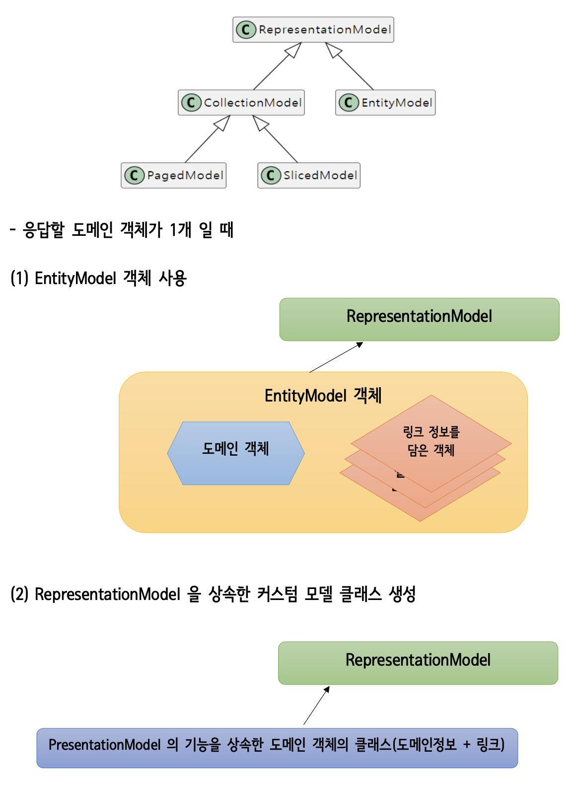
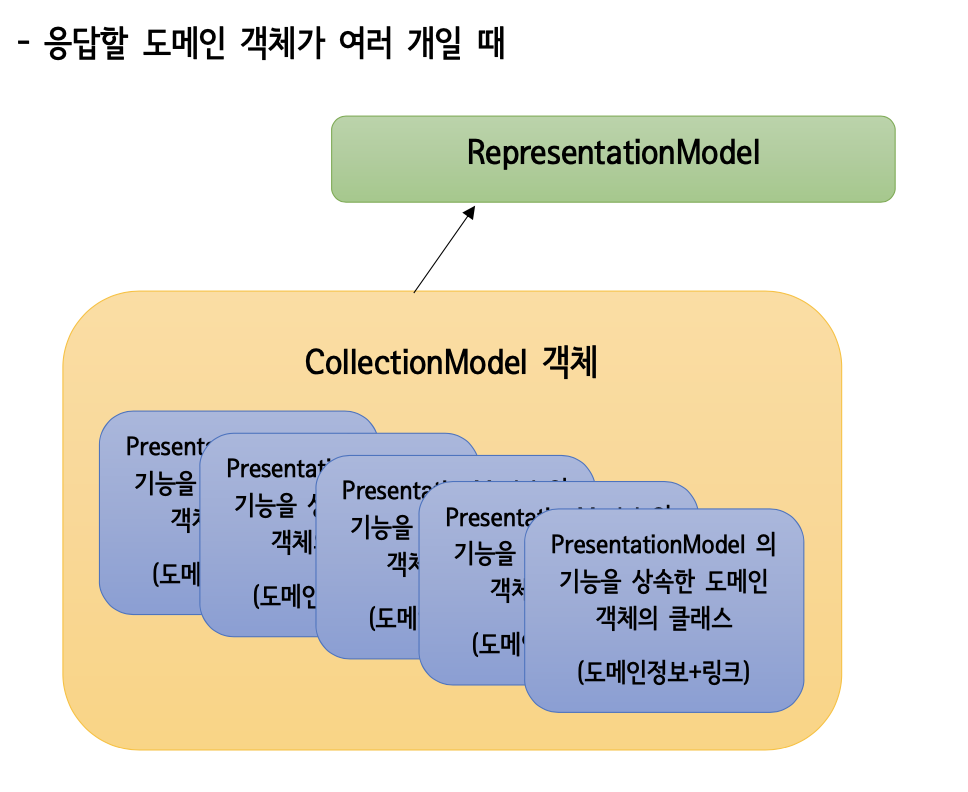

### Spring HATEOAS 구현 설명

**EntityModel : 하나의 데이터를 받을 때**



**CollectionModel : 전체 데이터를 받을 때**



### 링크 객체 생성

(1) 컨트롤러 메서드의 호출 URL 정보를 추출하여 Link 객체 생성

WebMvcLinkBuilder의 static 메서드 linkTo( )
요청 패스를 가지고 클라이언트에서 요청 가능한 컨트롤러 클래스의 메서드에 대한 링크 정보를 담 고 있는 WebMvcLinkBuilder 객체를 반환 org.springframework.hateoas.server.mvc.WebMvcLinkBuilder 객체의 static 메서드

```java
linkTo(methodOn(getClass()).hateoasTest1().withSelfRel() 
linkTo(methodeOn(UserController.class).retriveUser(2)).withRel(”3”)                                                                     
```

(2) URL 문자열을 직접 지정해서 Link 객체 생성

```java
Link.of(“정적 URL 문자열”, “이름”)
지정된 이름과 URL 문자열을 가지고 Link 객체 생성
org.springframework.hateoas 의 클래스 [ 주요 메서드들 ]
).withRel("test3")
```