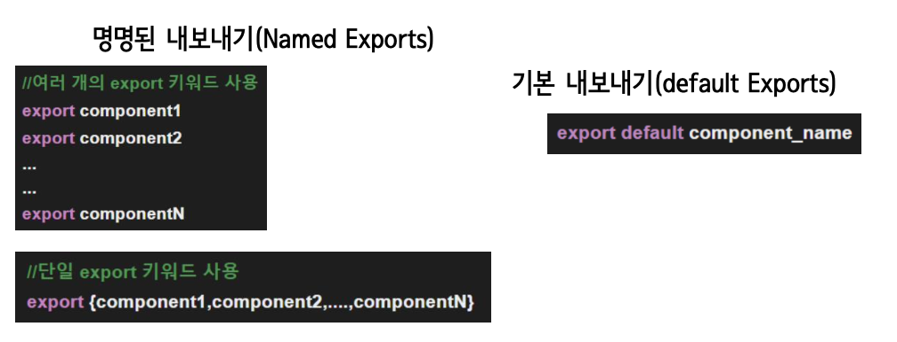
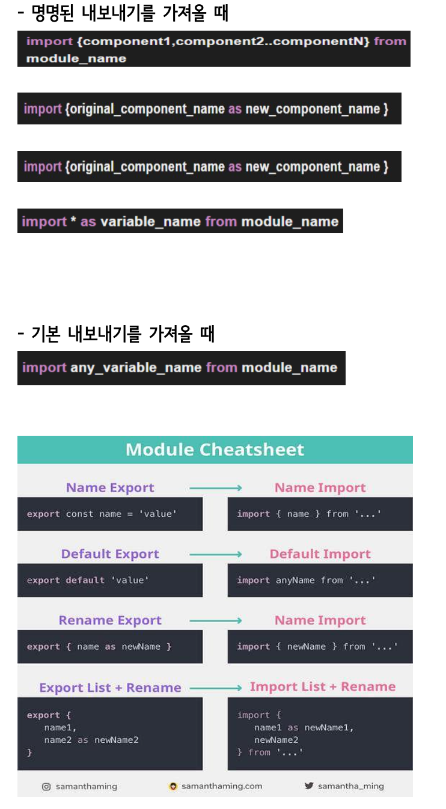

### 웹 렌더링 방식 (SSR, CSR, SSG)

**[ 초창기 웹 렌더링 ]**

초창기의 모든 웹 페이지는 정적인 페이지였다. 화면에 변화를 주고자 화면을 전환한다면 그럴 때마다 서버로부터 새로운 HTML을 전송받아 다시 렌더링하는 방식이었다.

**[ Ajax의 등장 ]**

자바스크립트를 활용해 서버와 브라우저가 비동기로 데이터를 주고받을 수 있는 기술이 등장하면서 매 번 전체페이지에 대한 데이터를 가져오는 것이 아닌 필요한 부분의 데이터만 불러와 웹사이트 화면을 동적으로 변경할 수 있게 되었다.

이런 과정 속에서 클라이언트 사이드에서 쉽게 화면 처리를 할 수 있도록 여러 가지 라이브러리나 프레임워크가 만들어지기 시작했다.

**[ CSR(Client Side Rendering)** **]**

서버에서 아무 내용이 없는 빈 HTML 껍데기를 보내 면 클라이언트에서 동적으로 태그들과 스타일을 생성하여 페이지를 채운다.

많은 양의 자바스크립트 코드가 실행되다 보니 첫 페이지 로딩까지 시간이 소요되지만, 최초에 Single Page만 서버로부터 불러와 렌더링하고 그 이후 에는 모든 것을 클라이언트 사이드에서 렌더링하는 어플리케이션이다.

**[ SSG(Static Site Generation)** **]**

모든 유저에게 항상 같은 내용을 보여주는 페이지 는 매 번 동적으로 생성할 필요가 없어 한 번만 생성한 이후에 CDN으로 어딘가에 저장해두고 필요할 때마다 로드하면 되는 것이 SSG이다.

**[ SPA(single-page application)** **]**

단일 페이지 애플리케이션으로, 현재의 페이지를 동적으로 작성함으로써 사용자와 소통하는 웹 애플 리케이션이다. 연속되는 페이지 간의 사용자 경험을 향상시키고, 웹 애플리케이션이 데스크톱 애플리 케이션처럼 동작하도록 도와준다. 이러한 구성을 하기 위해서는 기본적으로 프런트엔드와 백엔드 영 역의 분리가 선행되어야 한다.

### Same Origin Policy 제약

CORS disabled가 뜨는 이유는 컨텐트 보호 때문이다.

서버에서는 보내주지만 브라우저에서 체크한다.

**origin = 서버주소 + 포트번호.**

서버주소와 포트번호까지 같아야 Origin이 같은것이다.

만약 다른 포트번호로 하고싶다면 해당하는 Controller에서 @CrossOrigin(origins = "**", allowedHeaders = "**") 어노테이션을 추가해주면 포트번호가 다르더라도 동작할 수 있다.

---

### 모듈

자바스크립트 코드의 일부를 재사용하려는 경우 모듈 개념을 사용한다. 모듈은 단지 자바스크립트 소스 파일 하나에 불과하다.

**export 지시자를 변수나 함수 앞에 붙이면 외부 모듈에서 해당 변수나 함수에 접근할 수 있다. → 모듈 내보내기
import 지시자를 사용하면 외부 모듈의 기능을 현재 모듈로 가져올 수 있다. → 모듈 가져오기**

### 모듈 내보내기

### 모듈 가져오기

