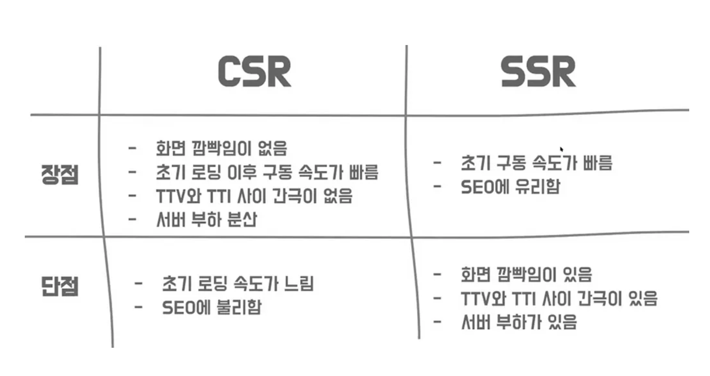

### CSR, SSR

만약 서비스가 사용자와의 상호작용이 많고, 대부분 페이지가 고객의 개인정보 기반이라면 SEO보다 데이터 보호측면이 중요. (모든 서비스에 SEO가 필요하지 않다) → CSR이 적합

만약 회사 홈페이지와 같은 노출에 신경써야 하는 페이지나 누구에게나 같은 페이지를 공유하는 서비스라면 혹은 업데이트도 자주 필요할 경우→ SSR이 적합



**SSR**

-   상위노출이 필요한 경우
-   누구에게나 동일한 내용을 노출
-   페이지마다 데이터가 자주 바뀔 경우

**CSR**

-   개인정보 데이터를 기준으로 구성될 경우
-   보다 나은 사용자 경험을 제공하고 싶을 경우
-   상위노출보다 고객의 데이터 보호가 더 중요할 경우

### 라우팅(Routing)

애플리케이션의 라우팅은 사용자가 태스크를 수행하기 위해 어떤 화면(view)에서 다른 화면으로 화면을 전환하는 내비게이션을 관리하 기 위한 기능이다.

라우팅을 서버가 아닌 브라우저 단에서 구현해야 하는것이 SPA 개발의 핵심으로 요청 URI에 따라 브라우저에서 돔(DOM)을 변경하는 방식이다.

### 컴포넌트(Component)

컴포넌트들이 모여 한 페이지를 구성하고, 특정 부분만 데이터를 바인딩하는 개념이다. index.html 파일 하나에서 js, css등 리소스 파일들과 모듈들을 로드해서 페이지 이동 없이 특정 영역만 새로 모듈을 호출하고 데이터를 바인딩한다.

### 반응형 변수

ref : 프락시 객체로 만들 데이터 타입에 제한이 없다. ref 값을 변경할 때는 변수명.value 값을 변경하기 때문에 반드시 value라는 속성을 사용하여 데이터를 다뤄야한다.

reactive : 객체의 속성 값을 변경가능하며 primitive 값에 대해서는 반응형을 갖지 않는다. 다만 구조체 형태로 선언하면 반응 형으로 동작한다.

```html
<template>
<div>
	{{refCount}}
	<br/>
	{{reactiveState.count}}
</div>
</template>

<script>
import { reactive, ref } from ‘vue’;
export default { setup() {
const refCount = ref(0);
const increaseRefCount = () => {
	refCount.value++; // .v:alue 속성을 사용하여 값을 가져오고 설정 };
	const reactiveState = reactive({ count: 0
});
const increaseReactiveStateCount = () => {
	reactiveState.count++; };
		return {
		refCount, reactiveState,
		}
	},
}
```

### <script setup>

SFC(Single-File Components) 내에서 Composition API를 사용하기 위한 컴파일 타임 구문 설탕(compile-time syntactic sugar)

```html
<script setup>
	// 컴파일 될 때 Setup() 함수에 들어가는 내용이 된다..
</script>
- 변수 선언, 함수 정의,import 처리 등 모두 템플릿 영역에서 사용되도록 자동
바인딩 된다.
<script setup>
	const msg = "Hello!";
	function log() {
		console.log(msg);
	}
</script>

<template>
	<button @click="log">{{ msg }}</button>
</template>

<script setup>
	import { capitalize } from "./helpers";
</script>

<template>
	<div>{{ capitalize('hello') }}</div>
</template>

- 반응성 변수들을 사용해야 템플릿과 바인딩 된다.
<script setup>
	import { ref } from 'vue'const count = ref(0)
</script>

<template>
	<button @click="count++">{{ count }}</button>
</template>

- import 된 컴포넌트도 컴포넌트 등록을 하지 않아도 템플릿에서 태그로 사용
가능하다.
<script setup>
	import MyComponent from "./MyComponent.vue";
</script>

<template>
	<MyComponent />
</template>

- defineProps() & defineEmits() 을 사용해서 부모 컴포넌트와 데이터를 송수신 할
수 있다.
<script setup>
	const props = defineProps({
		foo: String,
	});

	const emit = defineEmits(["change", "delete"]);
	// setup code
</script>
```

### Vue3 의 컴포넌트간의 통신 방법

(1) props

(2) emit

(3) v-model

(4) refs

(5) provide/inject

(6) eventBus

(7) vuex/pinia

### Vue3.0 의 Emit 구현 방법

emit는 컴포넌트에서 발생한 이벤트를 상위 부모에게 전달하는 키워드이다.
script 코 드에서 이벤트를 발생하는 방법과 template 코드에서 이벤트를 발생시키는 2가지 방법이 있다.

**emit 예제(1)**

```html
<template>
	<h2>Child Component</h2>
	<button @click="onClicked">Emit from script</button>
	<button @click="$emit('event2'2)">Emit from template</button>
</template>

<script>
	export default {
		emits: ["event1", "event2"],
		setup(props, context) {
			const { emit } = context;
			const onClicked = () => {
				emit("event1", 10);
			};

			return {
				onClicked,
			};
		},
	};
</script>
```

**emit 예제(2) : getCurrentInstance 사용**

emit는 getCurrentInstance()를 이용해서도 획득할 수 있다. 기존에는 useContext를 이용해서 획 득할 수 있었는데, Vue 3.2.0 버전부터 useContext는 deprecated 되었다.

```html
<script>
	import { getCurrentInstance } from "vue";

	export default {
		emits: ["event1", "event2"],
		setup() {
			const { emit } = getCurrentInstance();
			const onClicked = () => {
				emit("event1", 10);
			};
			return { onClicked };
		},
	};
</script>
```

**emit 예제(3) : <script setup> 내에서 사용하는 방법**

```html
<script setup>
	import { defineEmits } from "vue";

	const emit = defineEmits(["커스텀이벤트명"]);
	const toggleDrawer = () => {
		emit("커스텀이벤트명");
	};
</script>
```
