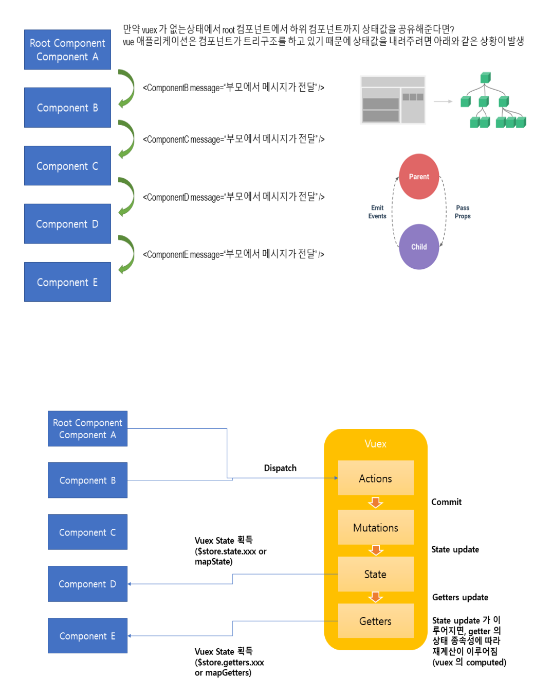
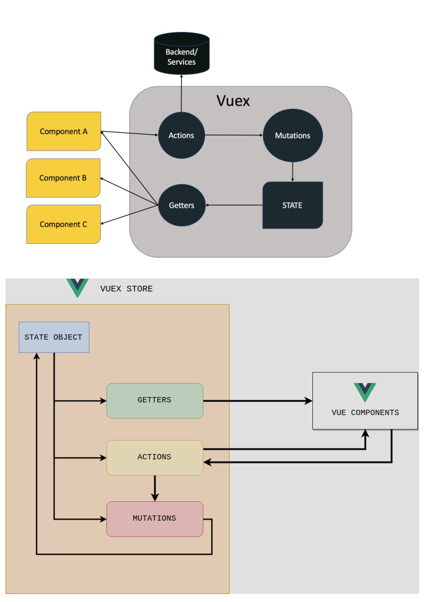

### provide와 Inject

부모 컴포넌트는 모든 자식 컴포넌트에 대한 의존성 제공자 역할을 할 수 있다. 하위 트리의 모든 컴포넌트는 깊이에 관계없이 상위 체인의 컴포넌트에서 제공(provide)하는 의존성을 주입(inject)할 수 있다.

하지만 부모 컴포넌트를 주입받은 자식컴포넌트에서 값을 변경하면 그 자식 컴포넌트를 주입받는 컴포넌트는 바로 상위 컴포넌트의 값을 주입받는다.

### VueX

state : 뷰 컴포넌트에서 사용되는 데이터

getter : 뷰 컴포넌트의 computed()와 동일한 기능을 작성하는 부분, state 데이터를 읽기만 가능

mutations : 뷰 컴포넌트의 methods()와 동일한 기능을 작성하는 부분, - state 값 변경 가능

actions : 쌍방통행 함수(= methods)이 외의 함수를 작성하는 부분, 비동기적 처리가능, state 데이터를 읽기만 가능, mutations에 작성되는 로직 외 대부분의 로직을 actions에 작성하는 것을 권장함. - setter 역할이라고 생각하면 되지만, actions를 통해서 직접 바꿀수는 없고, mutations를 통해서 변경한다.

### Pinia

Pinia는 Vue.js용 스토어 라이브러리 및 상태 관리 프레임워크이다. 주로 프런트 엔드 웹 애플리케이션 구축을 위해 설계되었으며 선언적 구문을 사용하고 자체 상태 관리 API를 제공한다. 다음 용어는 Pinia에서 고유한 의미가 있다.

| Store   | 전역 데이터가 저장되는 저장소     |
| ------- | --------------------------------- |
| State   | 전역 데이터                       |
| Getters | 저장소에서 데이터를 검색하는 방법 |
| Actions | 저장소에서 데이터를 수정하는 방법 |

**자손에게만 상속하려면 프로바이드를 사용하는것을 추천합니다.**
