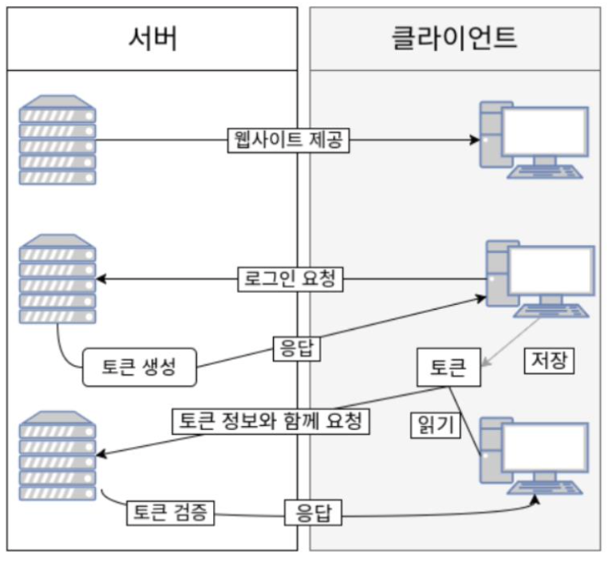

### Spring Security

1. Authentication(인증) : 특정 대상이 "누구"인지 확인하는 절차이다.

2. Authorization(권한부여,인가) : 인증된 주체가 특정한 곳에 접근 권한을 확인하고 허용하는 과정이다.

Spring security는 여러가지 필터로 이루어져있고, 필터들이 순서대로 동작하게 된다. 이러한 구조를 Filter Chain이라고 한다.


Spring Security는 Spring기반의 어플리케이션 보안(인증과 권한, 인가 등)을 담당하는 스프링 하위 프레임워크이다. Security는 인증과 권한에 대한 부분을 Filter의 흐름에 따라 처리한다.

-   **Spring Security의 securityConfig 작성**

WebSecurityConfigurerAdapter가 Deprecated 되었으니 SecurityFilterChain를 Bean으로 등록 해서 사용해야 하지만 두 가지 방법 모두 가능하며 구현 방법도 비슷하다.

-   authorizeRequest() (보안 절차를 거치고)
-   anyRequest() (어떠한 request라도)
-   authenticated() (인증을 받아야 함)
-   formLogin() (그 방식은 폼 로그인)

형식으로 설정 클래스가 처리된다. 최종적으로 SecurityFilterChain 타입으로 값을 빌드하여 리턴 해야한다. 그 외에도 다양한 사용자 정의 보안 설정 적용이 가능합니다.

```java
public class SecurityConfig {
@Bean
public SecurityFilterChain filterChain(HttpSecurity http) throws Exception {
	http
	.authorizeRequests()
	.anyRequest().authenticated() .formLogin();
		return http.build();
}
```

기본적으로 사용되는 formLogin 인증 API 구조는 다음과 같다.

```java
http.formLogin()
.login("/login")
.defaultSuccessUrl("/home")
.failureUrl("/login")
.usernameParameter("username")
.passwordParameter("password")
.loginProcessingUrl("/login")
.successHandler(loginSuccessHandler())
.failereHandler(loginFailureHander())
```

login : 사용자가 정의한 로그인 페이지
defaultSuccessUrl: 로그인 성공 후 이동하는 페이지
failureUrl: 로그인 실패 후 이동하는 페이지
usernameParameter: 폼 태그에 사용되는 아이디 파라미터명
passwordParameter: 폼 태그에 사용되는 비밀번호 파라미터명
loginProcessingUrl: 폼 태그에 사용되는 url
successHandler: 로그인 성공 후 실행되는 handler
failereHandler: 로그인 실패 후 실행되는 handler

-   **핸들러 작성 예**

```java
.successHandler((request, response, authentication) -> {
	log.info("authentication name = {}", authentication.getName())
	response.sendRedirect("/");
	})

.failureHandler((request, response, exception) -> { log.info("exception.getMessage() = {}", exception.getMessage()); response.sendRedirect("/login");
})
```

Spring Security는 dispatcherServlet 이전에 필터링하는 역할을 수행하므로, 여기서 지칭하는 핸들러는 Security에 내장된 혹은 사용자가 정의한 핸들러이다.

successHandler를 람다식으로 해당 폼 로그인을 성공하면 인증객체의 이름으로 로그를 찍고, "/"으 로 리다이렉트하는 핸들러를 작성한 것이다. 만약 실패할 경우, 필터가 fauilerHandler를 찾아 해당 람다식 핸들러를 실행시킨다.

### Login Form 인증 절차

폼 로그인의 절차는 다음과 같다.


1. Http Request가 서버로 넘어온다.

2. AuthenticationFilter가 요청을 낚아챈다. AuthenticationFilter에서 Request의 Username,

password를 이용하여 UsernamePasswordAuthenticationToken을 생성한다.

3. 토큰을 AuthenticationManager가 받는다.

4. AuthenticationManager는 토큰을 AuthenticationProvider에게 토큰을 넘긴다.

5. AuthenticationProvider는 UserDetailsService로 토큰의 사용자 아이디(username)을 전달하여

DB에 존재하는지 확인한다.

6. UserDetailsService는 DB의 회원정보를 UserDetails 라는 객체로 반환한다.

7~10. AuthenticationProvider는 반환받은 UserDetails 객체와 실제 사용자의 입력정보를 비교한다. 비교가 완료되면 사용자 정보를 가진 Authentication 객체를 SecurityContextHolder에 담은 이후 AuthenticationSuccessHandle를 실행한다. (실패시 AuthenticationFailureHandler를 실행한다.)

### SecurityFilterChain 다중 필터 관리

client가 request 요청을 보내면, Spring Container 이전에 Servlet Container에서 먼저 Filter에 의해 여러 가지 요청이 처리된다. SpringContainer와 Was 서버 간에 request 요청이 연결되어야 하는 데, 이를 수행하는 Filter가 DelegatingFilterProxy 이다.

DelegatingFilterProxy는 SpringContainer에 존재하는 FilterChainProxy에게 해당 요청을 위임함 으로써, request를 Spring Container에서 처리할 수 있다. 위임 전략을 사용하는 이유는, 스프링에서 제공하는 다양한 기술들을 사용할 수 있기에 다양한 장점이 있기 때문이다.

### JWT (Json Web Token)

Cookie / Session / Token 인증 방식 종류

보통 서버가 클라이언트 인증을 확인하는 방식은 대표적으로 쿠키, 세션, 토큰 3가지 방식이 있다.

**Cookie 인증**

쿠키는 Key-Value 형식의 문자열 덩어리이다.

클라이언트가 어떠한 웹사이트를 방문할 경우, 그 사이트가 사용하고 있는 서버를 통해 클라이언트 의 브라우저에 설치되는 작은 기록 정보 파일이다. 각 사용자마다의 브라우저에 정보를 저장하니 고유정보 식별이 가능하다.

쿠키를 사용하면 유효 시간을 적용할 수 있고, 유효 도메인을 적용할 수 있다.

하지만 보안에 취약하다는 단점이 있고, 브라우저간의 공유가 불가능하다.(origin방식이 적용되었다)


**Session 인증**

쿠키의 보안적인 이슈 때문에, 세션은 비밀번호 등 클라이언트의 민감한 인증 정보를 브라우 저가 아닌 서버 측에 저장하고 관리한다. 서버의 메모리에 저장하기도 하고, 서버의 로컬 파일이나 데이터베이스에 저장하기도 한다.

민감한 정보는 클라이언트에 보내지 않고 서버에서 모두 관리한다는 점으로 세션 객체는 Key에 해당하는 SESSION ID와 이에 대응하는 Value로 구성되어 있다. Value에는 세션 생성 시간, 마지막 접근 시간 및 User가 저장한 속성 등 이 Map 형태로 저장된다.

하지만 세션의 경우 ID 자체는 유의미한 개인정보를 담고있지 않지만 해커가 세션 ID 자체를 탈취하여 클라이언트인척 위장할 수 있다는 한계가 존재한고, 서버에서 세션 저장소를 사용하므로 요청이 많아지면 서버에 부하가 심해지는 단점이 있다.


**Token 인증**

토큰 기반 인증 시스템은 클라이언트가 서버에 접속을 하면 서버에서 해당 클라이언트에게 인증되었 다는 의미로 '토큰'을 부여한다. 이 토큰은 유일하며 토큰을 발급받은 클라이언트는 또 다시 서버에 요청을 보낼 때 요청 헤더에 토큰을 심어서 보낸다. 그러면 서버에서는 클라이언트로부터 받은 토큰 을 서버에서 제공한 토큰과의 일치 여부를 체크하여 인증 과정을 처리하게 된다.

인증받은 사용자에게 토큰을 발급하고 로그인이 필요한 작업일 경우 헤더에 토큰을 함께 보내 인증받은 사용자인지 확인한다. 이는 서버 기반 인증 시스템과 달리 상태를 유지하지 않으므로 Stateless한 특징을 가지고 있다.



(1) 사용자가 아이디와 비밀번호로 로그인을 한다.
(2) 서버 측에서 사용자(클라이언트)에게 유일한 토큰을 발급한다.
(3) 클라이언트는 서버 측에서 전달받은 토큰을 쿠키나 스토리지에 저장해 두고, 서버에 요청을 할 때마다 해당 토큰을 HTTP 요청 헤더에 포함시켜 전달한다.
(4) 서버는 전달받은 토큰을 검증하고 요청에 응답한다.
(5) 토큰에는 요청한 사람의 정보가 담겨있으므로 서버는 DB를 조회하지 않고 누가 요청하는지 알 수 있다.

하지만 토큰은 데이터 길이가 길어 인증 요청이 많아질수록 네트워크 부하가 심해질 수 있고, 토큰을 탈취당했을 시 대처가 어렵기 때문에 사용기간 제한을 설정하는 방식으로 극복한다.

### JWT (JSON Web Token)

JWT(JSON Web Token)란 인증에 필요한 정보들을 암호화시킨 JSON 토큰이다. JWT는 JSON 데이터를 Base64 URL-safe Encode 를 통해 인코딩하여 직렬화한 것이며, 토큰 내부 에는 위변조 방지를 위해 개인키를 통한 전자서명도 들어있다. 따라서 사용자가 JWT 를 서버로 전 송하면 서버는 서명을 검증하는 과정을 거치게 되며 검증이 완료되면 요청한 응답을 돌려준다.


Header 에는 JWT 에서 사용할 타입과 해시 알고리즘의 종류가 담겨있으며, Payload 는 서버에서 첨부한 사용자 권한 정보와 데이터가 담겨있다. 마지막으로 Signature 에는 Header, Payload 를 Base64 URL-safe Encode 를 한 이후 Header 에 명시된 해시함수를 적용하고, 개인키(Private Key) 로 서명한 전자서명이 담겨있다.

### Spring Security + JWT 예외처리 하기

JWT를 구현하면 jjwt 라이브러리 내부에서 여러가지 내용으로 예외를 던지고 있다. 그렇게 예외가
던져지게 되고, 내가 별도의 처리를 해주지 않으면 Response로 "Internal Server Error",
"Forbbiden"과 같은 값들이 Response가 된다.

직접 예외를 처리하고자 하는 경우 다음 사항을 고려해 볼 수 있지만, 3번을 권장한다.

(1) Advice 로 구현하여 적용

(2) JWTExceptionFilter 를 구현하여 적용

(3) 후처리 객체인 AuthenticationEntryPoint 사용
