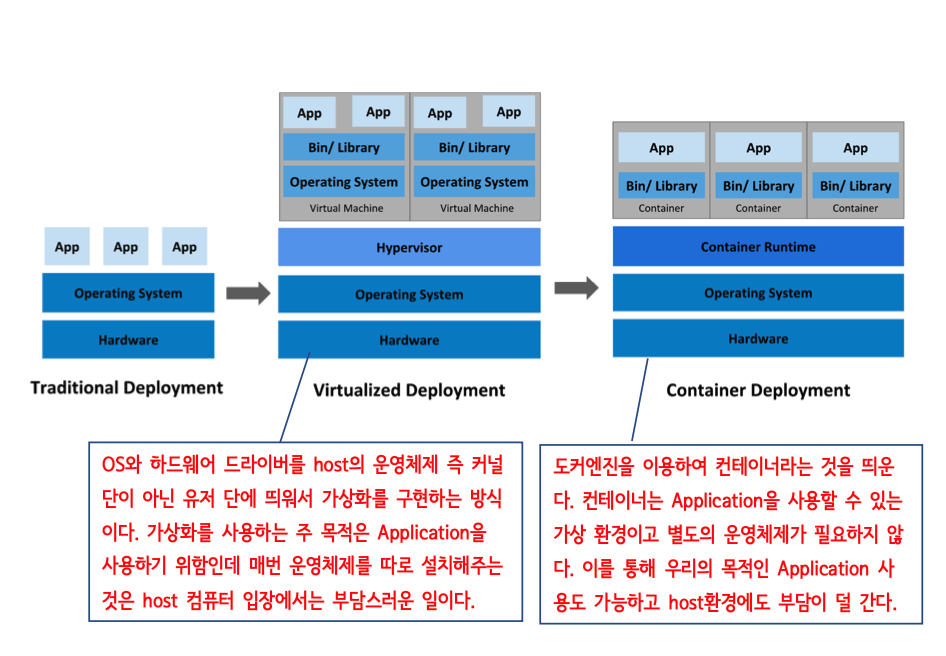

### YAML

서로 다른 시스템 간에 데이터를 주고 받을 필요가 있을 때 데이터 연동과 호환성을 위해 포맷에 대
한 규칙이 필요하다. CSV, XML, JSON, Properties 등이 바로 이런 용도로 사용된 파일들이다.

대부분의 웹에서 데이터 통신을 위해 JSON을 많이 사용하고, reference를 정의할 때 복잡한 object 구조를 표현 하기 위해 YAML이 적합하다.

Docker: compose파일을 yaml로 작성하고 배포한다.

쿠버네티스: 지금껏 어떤 프레임워크보다 yaml을 광범위하게 사용하는 프레임워크 중 하나이다.

스프링 부트: yaml 방식의 설정 파일을 사용할 수 있다. (application.properties -> application.yaml)
물론 일반 스프링에서도 별도로 설정할 수 있다면 사용할 수 있다.

### Docker

Docker 기술은 Linux 커널과 Cgroups 및 네임스페이스 등 커널의 기능을 사용하여 프로세스 를 분리함으로써 독립적으로 실행할 수 있도록 합니다. 이러한 독립성은 컨테이너의 본래 목적 입니다. 다시 말해서, 여러 프로세스와 애플리케이션을 서로 개별적으로 실행하여 인프라를 더 효과적으로 활용하고 개별 시스템을 사용할 때와 동일한 보안을 유지할 수 있습니다.

### 가상 머신과 도커 컨테이너 비교

하이퍼바이저는 호스트 컴퓨터에서 다수의 운영 체제를 동시에 실행하기 위한 논리적 플랫폼을 말한다. 가상화 머신 모니터 또는 가상화 머신 매니저라고도 부른다.

### 마운트 종류

-   볼륨 마운트
-   바인드 마운트

**볼륨 마운트**

-   도커 엔진이 관리하는 영역 내에 만들어진 볼륨을 컨테이너에 디스크 형태로 마운트하여 사용
-   직접 조작이 어려우므로 주로 ‘임시 목적’ 또는 ‘자주 쓰지는 않지만 지우면 안되는 파일을 저장’
    하는 목적으로 사용
-   도커 엔진에 의해 관리
    -   리눅스 경우 /var/lib/docker/volumns
    -   도커 데스크톱의 경우 도커 엔진의 관리영역
-   도커 엔진에 의해 관리
-   운영체제와 무관하게 일관성있는 방식으로 작업
-   도커 제작사에서 추천하는 방식
-   도커 컨테이너를 이용하지 않고는 접근 불가능
-   호스트에서 직접 제어하면 볼륨이 깨질 수 있음
-   백업절차복잡

**바인드 마운트**

-   도커 엔진에서 관리하지 않는 영역의 디렉터리를 컨테이너에 마운트하는 방식
-   해당 디렉터리를 직접 조회할 수 있으므로 자주 사용하는 파일을 보관하는 용도로 사용
-   기존에 사용하는 방식으로 파일 사용 가능
    -   도커 엔진과 무관하게 파일 제어
    -   파일 자주 편집해야 하는 경우 좋음
