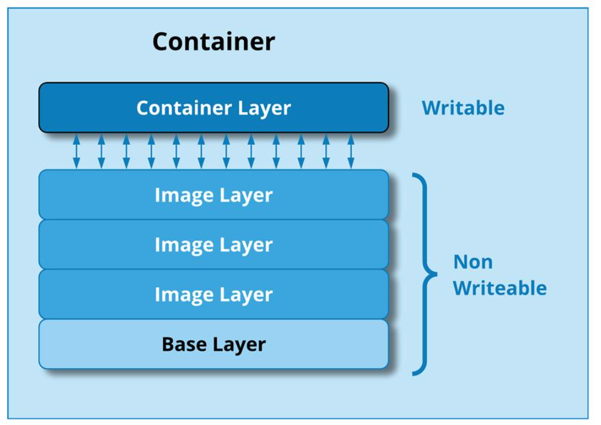

### 외부에서 사용중인 db를 활용해서 docker yml파일 만들기

```java
version: "1"
services:
  crewz:
    build:
      context: ./mini-project/crewz
      dockerfile: Dockerfile
    environment:
      SPRING_DATASOURCE_URL: jdbc:mysql://db주소/db스키마 이름
      SPRING_DATASOURCE_USERNAME: 아이디
      SPRING_DATASOURCE_PASSWORD: 비밀번호
    networks:
      - crewznet
    ports:
      - 8081:8081
    restart: on-failure

  crewz-admin:
    build:
      context: ./mini-project-2/crewz-admin/crewz-admin
      dockerfile: Dockerfile
    environment:
      SPRING_DATASOURCE_URL: jdbc:mysql://db주소/db스키마 이름
      SPRING_DATASOURCE_USERNAME: 아이디
      SPRING_DATASOURCE_PASSWORD: 비밀번호
    networks:
      - crewznet
    ports:
      - 8082:8082
    restart: on-failure

networks:
  crewznet:
```

### docker 올리고, tar파일 저장하기

```bash
docker compose build
docker compose up

docker save -o 저장하려는파일이름.tar docker에올라간image이름
docker save -o crewz-admin.tar docker-crewz-admin
```

### 텍스트 Multi Line

개행이 있는 문자열을 JSON으로 표현한다면, 문자열 내에 \n 문자를 사이사이 넣어주어야 한다.
YAML에서는 일반적인 프로그래밍과 다르게 다른 방법으로 지원한다.
개행된 문자열을 표현하는데 다음과 같이 크게 두가지 방법이 존재한다.

(1) > 기호를 쓰는 방법(folded block scalar)

(2) | 기호를 쓰는 방법(literal block scalar)

개행문자를 그대로 인식한다.

### yaml 야물

일반적으로 설정파일로 사용하기에 더할 나위없이 좋은 형식이기 때문에 여러 프레임워크나 CI툴에 서 설정파일로 쓰이고 있다.

GitHub Action: 설정 파일이 .github/workflows/<워크플로 이름>.yml로 yaml형식을 사용한다.

Docker: compose파일을 yaml로 작성하고 배포한다.

쿠버네티스: 지금껏 어떤 프레임워크보다 yaml을 광범위하게 사용하는 프레임워크 중 하나이다.

### 도커 이미지의 구조

Docker에서 이미지란 컨테이너를 구동시키기 위한 필요한 파일과 설정값 등을 저장한 것이다. 이미 지는 변하지 않고(Immutable) 상태를 가지지 않는다(Stateless). 이미지는 단지 컨테이너를 구동할 때만 사용될 뿐, 실행 중에 변경된 내용은 컨테이너에 저장된다.

Docker 이미지의 핵심은 레이어 형태로 되어있다는 것이다. 유니온 파일 시스템을 이용해 여러 개의 레이어를 하나의 파일시스템으로 사용할 수 있게 해준다. 이미지는 여러 개의 읽기 전용 레이어로 구 성되고 파일이 추가되거나 수정될 때 새로운 레이어가 생성된다.

여러 이미지를 가지고 있다고 하여도 중복된 부분은 하나만 가지고 있어서 공간 효율적이고 확장이 좋다. 이런 확장성을 바탕으로 Docker Hub에는 다양한 이미지들이 존재하고 80억이 넘는 다운로드 가 이루어지고 있다.



### 도커를 사용하면 좋은 점

Docker를 사용할 경우, CentOS + Apache + Node.js + Source 형식의 이미지를 하나만 준비하고 원격으로 한 번에 모두 배포 및 구동한다. Apache가 Nginx로 교체된다면 CentOS + Nginx + Node.js + Source 의 형태로 이미지만 다시 제작하여 100대를 한 번에 배포한 후 컨테이너만 다시 가동시키면 된다. OS의 경우도 마찬가지이다.
