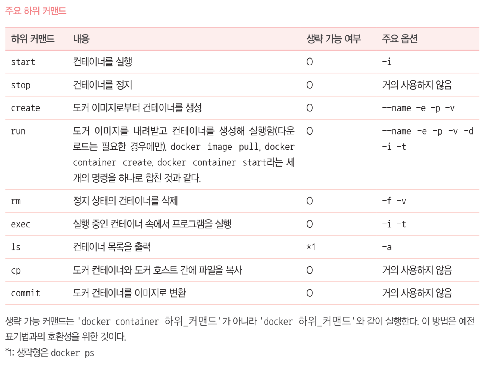

### 도커 컨테이너 제어 명령

docker [container] 하위명령 옵션



### 도커 이미지 제어 명령

docker image 하위명령 옵션


### 도커 볼륨 제어 명령

docker volume 하위명령 옵션


### 네트워크 제어 명령

docker network 하위명령어 옵션


### 도커 기타 명령어


### 단독 명령어


### 동작 중인 컨테이너는 삭제 불가능 - 컨테이너 정지 후 삭제해야함

docker stop & docker rm

### 컨테이너 생성 및 실행

docker run 옵션 이미지 [인자]


### docker 에서 mysql 실행오류

ERROR 2002 (HY000): Can't connect to local MySQL server through socket '/tmp/mysql.sock' (2)

docker ps 명령어로 container ID를 확인하여 최소 앞 3자리수의 아이디를 입력한 뒤 bash에서 실행한다.

```bash
docker ps
docker exec -it 015(container ID) bash
```


### MySQL 컨테이너 생성 및 실행

```bash
docker run --name 컨테이너이름 –dit --net=네트워크이름
–e MYSQL_ROOT_PASSWORD=MYSQL_루트_패스워드
–e MYSQL_DATABASE=데이터베이스이름
–e MYSQL_USER=MySQL사용자이름
–e MYSQL_PASSWORD=MySQL_패스워드
mysql
--character-set-server=문자_인코딩
--collation-server=정렬_순서
--default-authentication-plugin=인증방식

타임존 설정 : -e TZ=Asia/Seoul
```

### 도커 컨테이너의 저장소

Docker 컨테이너(container)에 쓰여진 데이터는 기본적으로 컨테이너가 삭제될 때 함께 사라짐

컨테이너가 사라져도 데이터 저장소를 계속 사용하고싶다. 혹은 여러 컨테이너가 함께 하나의 저장소를 공유해서 사용하고 싶을 때 데이터를 영속적으로 저장할 수 있도록 Docker는 두가지 옵션을 제공한다.

첫째로 불륨(volume), 두번째로는 바인드 마운트(bindmout)이다.

### 볼륨(볼륨 마운트)

-   도커 엔진이 관리하는 영역 내에 만들어진 볼륨을 컨테이너에 디스크 형태로 마운트하여 사용
-   직접 조작이 어려우므로 주로 ‘임시 목적’ 또는 ‘자주 쓰지는 않지만 지우면 안되는 파일을 저장하는 목적으로 사용
-   도커 엔진에 의해 관리
    -   리눅스 경우 /var/lib/docker/volumns
    -   도커 데스크톱의 경우 도커 엔진의 관리영역
-   운영체제와 무관하게 일관성있는 방식으로 작업
-   도커 제작사에서 추천하는 방식
-   도커 컨테이너를 이용하지 않고는 접근 불가능
-   백업 절차 복잡

| 항목          | 볼륨 마운트             | 바인드 마운트               |
| ------------- | ----------------------- | --------------------------- |
| 스토리지 영역 | 볼륨                    | 디렉터리 또는 파일          |
| 물리적인 위치 | 도커엔진의 관리 영역    | 어디든지 가능               |
| 마운트 절차   | 볼륨을 생성한 후 마운트 | 기존파일 또는 폴더를 마운트 |
| 내용 편집     | 도커 컨테이너를 통해서  | 일반적인 파일과 같이        |
| 백업          | 절차가 복잡함           | 일반적인 파일과 같이        |

### 볼륨 생성 방법

docker volumn create 볼륨이름
docker volumn rm 볼륨이름

### 파일만드는 명령어

```bash
mkdir
```
